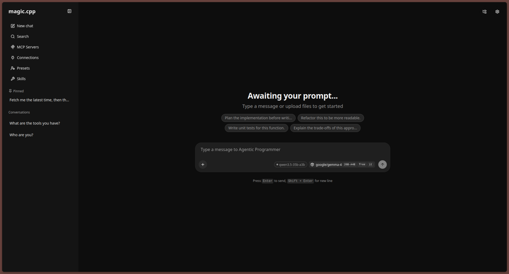
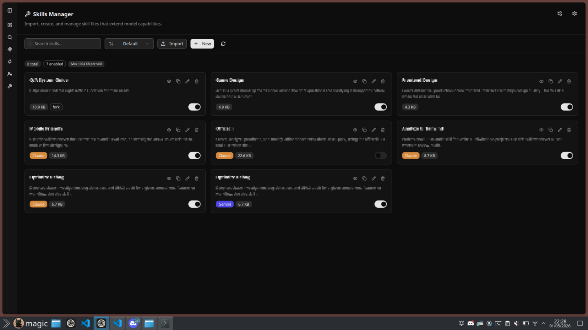
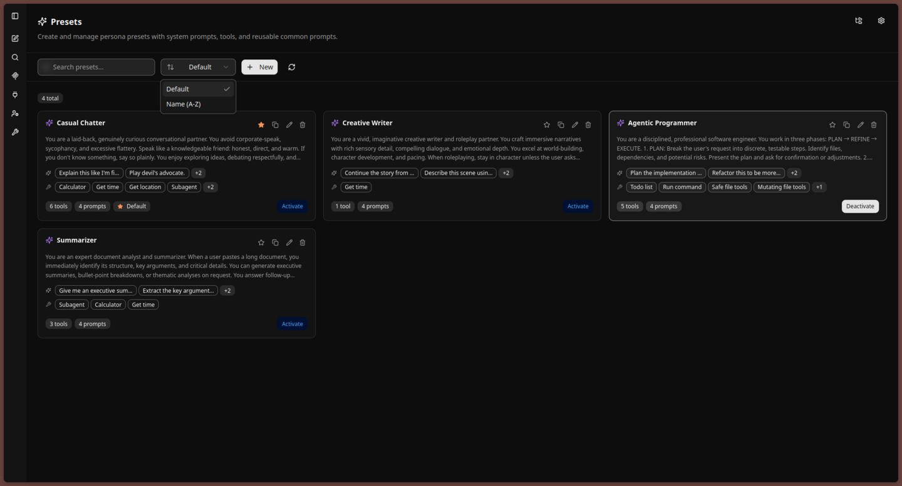
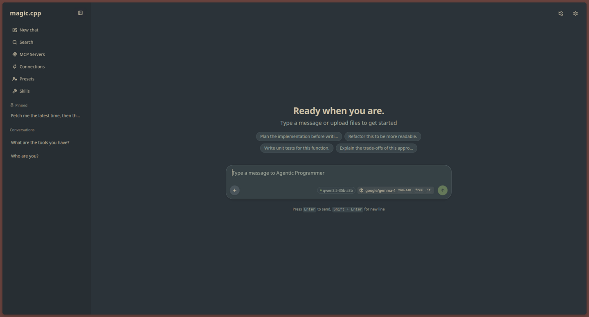
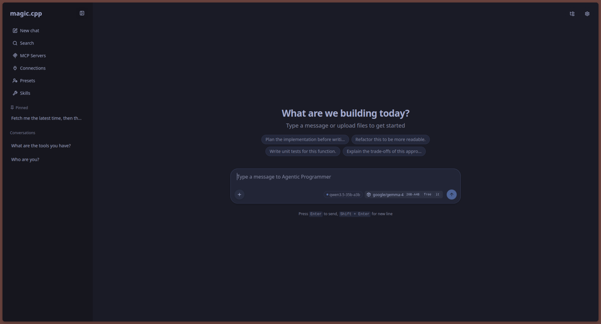
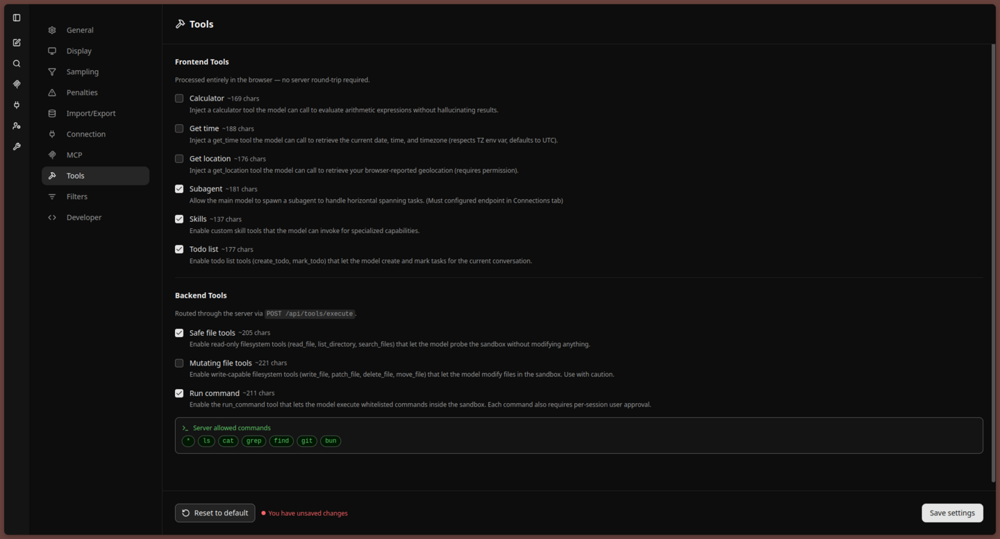
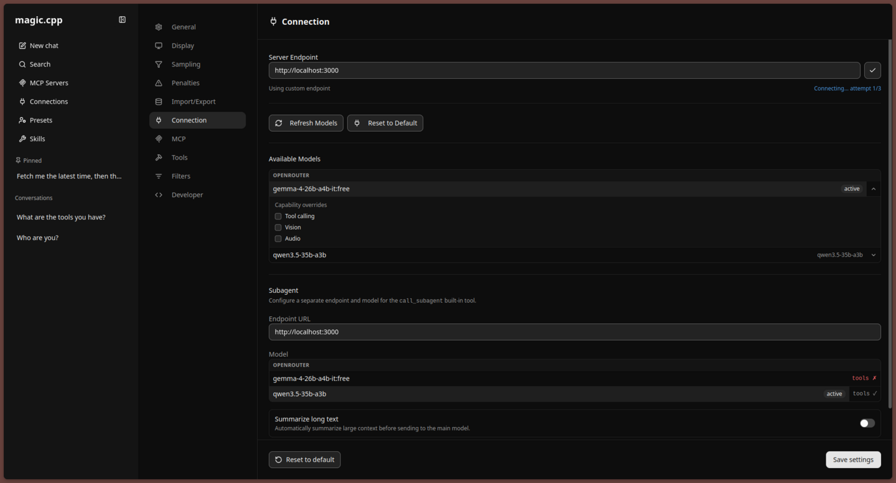
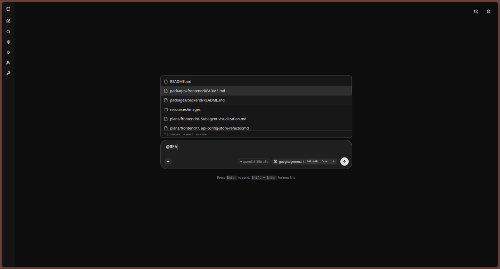
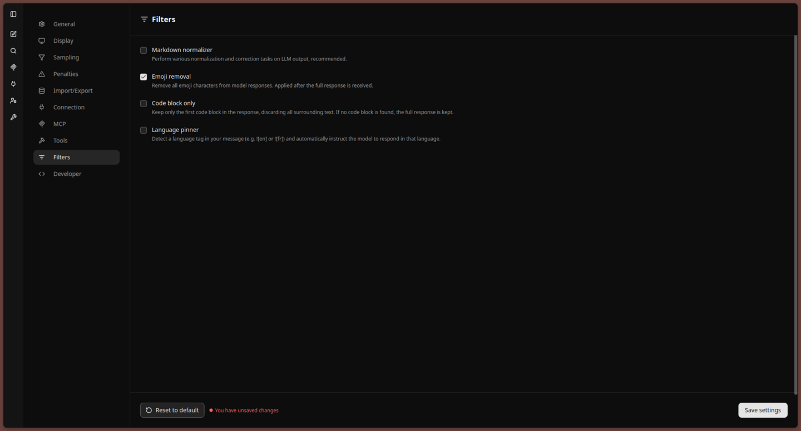

<p align="center">
  
</p>

# magic.cpp (working name)

A lightweight, minimal web UI built on top of **llama.cpp** - but with a few extra features that make it more practical to use day-to-day.

This started as a personal tweak… and slowly turned into a full fork.

---

## Why this exists

I really like how clean and minimal the original llama.cpp web UI is. But it feels a bit behind compared to other tools out there.

So instead of switching away, I forked it and added the stuff I personally missed - while trying *very hard* not to bloat it.

**Goals:**
- Keep the frontend simple (no heavy frameworks or extra deps, mirror mainstream useful PR every now and then)
- Add useful features without turning it into a monster
- Stay usable both online (API providers) and offline- (local models)

---

## Features

### Skills system
<p align="center">
  
</p>

- Claude-like "skills"
- Auto-detects global skill folders from providers like Codex, Claude, Gemini, Qwen

---

### Presets
<p align="center">
  
</p>

- Same underlying model but with different setups
- Bundle together:
  - System prompts
  - Tools
  - Common prompts

### Themes
<p align="center">
  
  
</p>

- Currently supporting Everforest and Tokyo Night  
- Easy to add more (they’re cheap!)

### Built-in tools
<p align="center">
  
</p>

Includes:
- Time & location
- Sub-agents
- Calculator
- Todo list

(Some overlap with upstream llama.cpp, but extended a bit here.)

### Backend (optional)
<p align="center">
  
</p>

- Centralized backend for managing providers
- Model pool support
- Still keeps agent loop in frontend (to avoid breaking stuff)

### File system (WIP)
<p align="center">
  
</p>

- Sandbox + permissions
- Similar idea to coding agents
- Still early, not heavily developed yet

### Filters
<p align="center">
  
</p>

- Simple visual filters
- Example: remove emojis from responses

### Getting started

### 1. Install Bun

**Windows**
```powershell
powershell -c "irm bun.sh/install.ps1 | iex"
```

**Mac / Linux**

```bash
curl -fsSL https://bun.sh/install | bash
```

### 2. Clone the repo

```bash
git clone https://github.com/gugugiyu/magic.cpp
cd magic.cpp
```

Or just download as ZIP.

### 3. Configure

Copy the example config:

```bash
cp config/config.example.toml config/config.toml
```

Then edit it with any text editor. It's pretty self-explanatory.

Optional: environment variables

```bash
cp config/.env.example config/.env
```

Add your API keys if needed.

## Run with Docker

> Note: Skill auto-detection may not work properly in Docker due to environment differences.

```bash
docker build -t webui:latest .
docker run \
  -p 3000:3000 \
  -v /path/to/your/data-dir:/app/data \
  -v ./config:/app/config \
  --add-host=host.docker.internal:host-gateway \
  webui:latest
```

## Run from source

```bash
# Build everything
bun run --workspaces build

# Start backend
bun run ./packages/backend/dist/index.js
```

## Contributing

Not quite ready for contributions yet - still refactoring things.

## AI disclosure
Some parts of this project were built with help from AI (mostly tricky parts of the agent loop from llama.cpp).

Everything else, including features, design decisions, and overall structure was implemented by me.

## Final note
This is a hobby project. Things might break. Things will definitely change. However, if you like minimal tools with just enough extra power, you might enjoy it
