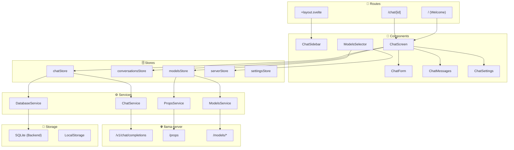
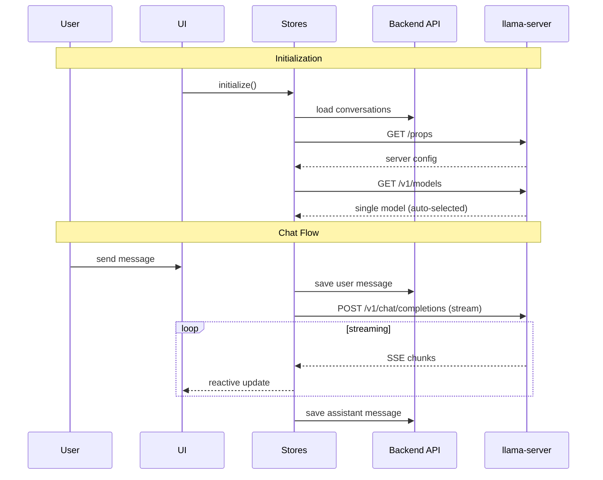
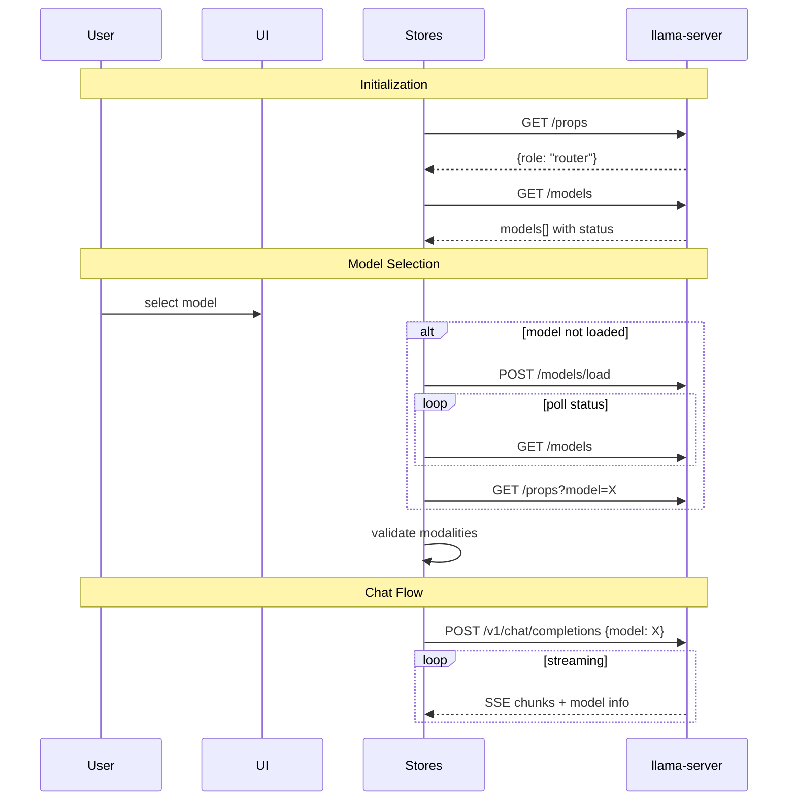
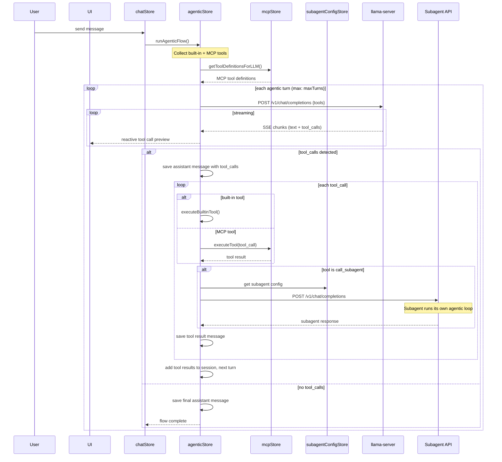
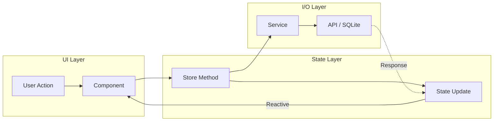

# llama.cpp Web UI

A modern, feature-rich web interface for llama.cpp built with SvelteKit. This UI provides an intuitive chat interface with advanced file handling, conversation management, agentic tool execution, and comprehensive model interaction capabilities.

The WebUI supports two server operation modes:

- **MODEL mode** - Single model operation (standard llama-server)
- **ROUTER mode** - Multi-model operation with dynamic model loading/unloading

---

## Table of Contents

- [Features](#features)
- [Getting Started](#getting-started)
- [Tech Stack](#tech-stack)
- [Build Pipeline](#build-pipeline)
- [Architecture](#architecture)
- [Data Flows](#data-flows)
- [Architectural Patterns](#architectural-patterns)
- [Testing](#testing)

---

## Features

### Chat Interface

- **Streaming responses** with real-time updates
- **Reasoning content** - Support for models with thinking/reasoning blocks
- **Dark/light theme** with system preference detection
- **Responsive design** for desktop and mobile

### Agentic Tool Execution (Multi-Turn Loop)

- **MCP (Model Context Protocol)** - Connect to external MCP servers via WebSocket, SSE, or Streamable HTTP
- **Built-in tools** - Execute tools entirely in the frontend without external servers:
  - **Calculator** - Evaluate math expressions (user-confirmed before execution)
  - **Time** - Current UTC date/time for temporal awareness
  - **Location** - Browser geolocation (user permission required)
  - **Sequential Thinking** - Structured step-by-step reasoning with live stepper UI
  - **Call Subagent** - Delegate tasks to a separate model on a different endpoint
  - **List/Read Skills** - Discover and read user-managed skill files
- **Agentic loop** - Multi-turn tool execution with configurable turn limits (default: 10)
- **Tool output summarization** - MCP outputs exceeding a line threshold are summarized by the subagent before returning to the main model
- **Streaming tool calls** - Tool call arguments stream in real-time with live preview

### Dual-Node Architecture (Main Model + Subagent)

- **Separate subagent endpoint** - Configured independently in Settings → Connection
- **Independent model selection** - Subagent uses its own model, separate from the main model
- **Recursive tool delegation** - Subagent runs its own agentic loop with MCP + built-in tools (no recursion to prevent infinite loops)
- **Progress tracking** - Real-time UI shows subagent model name, tool steps, and completion status
- **Skill association** - Tracks which skill triggered a subagent invocation for UI display

### Skill Vault/Manager

- **Import skills** - Upload `.md` skill files via drag-and-drop or file picker
- **Create/edit skills** - Full CRUD with inline markdown editor
- **Preview** - Render skill content with Markdown + KaTeX before saving
- **Enable/disable** - Per-skill toggle controls visibility to the model
- **Search & sort** - Filter by title/name/description; sort by recently modified, name, or enabled status
- **Duplicate** - Clone existing skills for quick iteration
- **Backend storage** - Skills persisted as `.md` files on the server's skill directory
- **$ARGUMENTS support** - Skills can include parameterized placeholders

### Response Filters

- **Emoji removal** - Strip all Extended Pictographic Unicode characters
- **Codeblock only** - Keep only the first fenced code block, discard surrounding text
- **Raw mode** - Strip all Markdown formatting for plain text display
- **Markdown normalizer** - Auto-fix formatting issues (unclosed code blocks, fullwidth symbols, Mermaid diagrams, heading spacing, table pipes, XML artifact tags)
- **Language pinner** - Detect `![xx]` language tags in user messages and append a language instruction to the API request (not stored in DB)
- **Display-only** - Filters apply at render time; raw content is never modified in storage

### File Attachments

- **Images** - JPEG, PNG, GIF, WebP, SVG (with PNG conversion)
- **Documents** - PDF (text extraction or image conversion for vision models)
- **Audio** - MP3, WAV for audio-capable models
- **Text files** - Source code, markdown, and other text formats
- **Drag-and-drop** and paste support with rich previews

### Conversation Management

- **Branching** - Branch messages conversations at any point by editing messages or regenerating responses, navigate between branches
- **Regeneration** - Regenerate responses with optional model switching (ROUTER mode)
- **Import/Export** - JSON format for backup and sharing
- **Search** - Find conversations by title or content

### Advanced Rendering

- **Syntax highlighting** - Code blocks with language detection
- **Math formulas** - KaTeX rendering for LaTeX expressions
- **Markdown** - Full GFM support with tables, lists, and more
- **Mermaid diagrams** - Auto-rendered with proper syntax fixing

### Multi-Model Support (ROUTER mode)

- **Model selector** with Loaded/Available groups
- **Automatic loading** - Models load on selection
- **Modality validation** - Prevents sending images to non-vision models
- **LRU unloading** - Server auto-manages model cache

### Keyboard Shortcuts

| Shortcut           | Action               |
| ------------------ | -------------------- |
| `Shift+Ctrl/Cmd+O` | New chat             |
| `Shift+Ctrl/Cmd+E` | Edit conversation    |
| `Shift+Ctrl/Cmd+D` | Delete conversation  |
| `Ctrl/Cmd+K`       | Search conversations |
| `Ctrl/Cmd+B`       | Toggle sidebar       |

### Developer Experience

- **Request tracking** - Monitor token generation with `/slots` endpoint
- **Storybook** - Component library with visual testing
- **Hot reload** - Instant updates during development

---

## Getting Started

### Prerequisites

- **Bun** 1.2+ (for the backend service)
- **Node.js** 18+ (20+ recommended, for the frontend)
- **npm** 9+
- **llama-server** running locally (for API access)

### 1. Install Dependencies

```bash
cd packages/frontend
npm install

cd ../backend
bun install
```

### 2. Start the Backend

The backend provides SQLite persistence and skill management:

```bash
cd packages/backend
bun run dev
```

This starts the backend API server (default port: 3001).

### 3. Start llama-server

In a separate terminal, start the backend server:

```bash
# Single model (MODEL mode)
./llama-server -m model.gguf

# Multi-model (ROUTER mode)
./llama-server --models-dir /path/to/models
```

### 4. Start Development Servers

```bash
cd packages/frontend
npm run dev
```

This starts:

- **Vite dev server** at `http://localhost:5173` - The main WebUI
- **Storybook** at `http://localhost:6006` - Component documentation

The Vite dev server proxies API requests to the backend and llama-server:

```typescript
// vite.config.ts proxy configuration
proxy: {
  '/api': 'http://localhost:3001',   // Backend API (SQLite, skills)
  '/v1': 'http://localhost:8080',    // llama-server chat completions
  '/props': 'http://localhost:8080', // llama-server properties
  '/slots': 'http://localhost:8080', // llama-server slot status
  '/models': 'http://localhost:8080' // llama-server model management
}
```

### Development Workflow

1. Open `http://localhost:5173` in your browser
2. Make changes to `.svelte`, `.ts`, or `.css` files
3. Changes hot-reload instantly
4. Use Storybook at `http://localhost:6006` for isolated component development

---

## Tech Stack

| Layer             | Technology                      | Purpose                                                     |
| ----------------- | ------------------------------- | ----------------------------------------------------------- |
| **Framework**     | SvelteKit + Svelte 5            | Reactive UI with runes (`$state`, `$derived`, `$effect`)    |
| **UI Components** | shadcn-svelte + bits-ui         | Accessible, customizable component library                  |
| **Styling**       | TailwindCSS 4                   | Utility-first CSS with design tokens                        |
| **Database**      | SQLite (via `bun:sqlite`)       | Server-side persistence for conversations, messages, skills |
| **Backend**       | Bun + native HTTP               | Lightweight API layer for frontend                          |
| **Build**         | Vite 7                          | Fast bundling with static adapter                           |
| **Testing**       | Playwright + Vitest + Storybook | E2E, unit, and visual testing                               |
| **Markdown**      | remark + rehype + mdsvex        | Markdown processing with KaTeX and syntax highlighting      |
| **Validation**    | Zod 4                           | Runtime type validation                                     |

### Key Dependencies

```json
{
	"svelte": "^5.0.0",
	"bits-ui": "^2.8.11",
	"pdfjs-dist": "^5.4.54",
	"highlight.js": "^11.11.1",
	"rehype-katex": "^7.0.1",
	"mermaid": "^11.0.0",
	"zod": "^4.0.0"
}
```

> **Note:** Dexie (IndexedDB ORM) has been replaced with a server-side SQLite backend. Conversations and messages are now persisted via HTTP API calls to the backend service, which uses `bun:sqlite` for storage.

---

## Build Pipeline

### Development Build

```bash
npm run dev
```

Runs Vite in development mode with:

- Hot Module Replacement (HMR)
- Source maps
- Proxy to llama-server and backend API

### Production Build

```bash
npm run build
```

The build process:

1. **Vite Build** - Bundles all TypeScript, Svelte, and CSS
2. **Static Adapter** - Outputs to `../public` (llama-server's static file directory)
3. **Post-Build Script** - Cleans up intermediate files
4. **Custom Plugin** - Creates `index.html` with:
   - Inlined favicon as base64
   - GZIP compression (level 9)
   - Deterministic output (zeroed timestamps)

```text
packages/frontend/        →  build  →  tools/server/public/
├── src/                                 ├── index.html  (served by llama-server)
├── static/                              └── (favicon inlined)
└── ...
```

### SvelteKit Configuration

```javascript
// svelte.config.js
adapter: adapter({
  pages: '../public',      // Output directory
  assets: '../public',     // Static assets
  fallback: 'index.html',  // SPA fallback
  strict: true
}),
output: {
  bundleStrategy: 'inline' // Single-file bundle
}
```

### Integration with llama-server

The WebUI is embedded directly into the llama-server binary:

1. `npm run build` outputs `index.html` to `tools/server/public/`
2. llama-server compiles this into the binary at build time
3. When accessing `/`, llama-server serves the gzipped HTML
4. All assets are inlined (CSS, JS, fonts, favicon)

This results in a **single portable binary** with the full WebUI included.

---

## Architecture

The WebUI follows a layered architecture with unidirectional data flow:

```text
Routes → Components → Hooks → Stores → Services → Storage/API
```

### High-Level Architecture

See: [`docs/architecture/high-level-architecture-simplified.md`](docs/architecture/high-level-architecture-simplified.md)



### Layer Breakdown

#### Routes (`src/routes/`)

- **`/`** - Welcome screen, creates new conversation
- **`/chat/[id]`** - Active chat interface
- **`+layout.svelte`** - Sidebar, navigation, global initialization

#### Components (`src/lib/components/`)

Components are organized in `app/` (application-specific) and `ui/` (shadcn-svelte primitives).

**Chat Components** (`app/chat/`):

| Component          | Responsibility                                                              |
| ------------------ | --------------------------------------------------------------------------- |
| `ChatScreen/`      | Main chat container, coordinates message list, input form, and attachments  |
| `ChatForm/`        | Message input textarea with file upload, paste handling, keyboard shortcuts |
| `ChatMessages/`    | Message list with branch navigation, regenerate/continue/edit actions       |
| `ChatAttachments/` | File attachment previews, drag-and-drop, PDF/image/audio handling           |
| `ChatSettings/`    | Parameter sliders (temperature, top-p, etc.) with server default sync       |
| `ChatSidebar/`     | Conversation list, search, import/export, navigation                        |

**Dialog Components** (`app/dialogs/`):

| Component                       | Responsibility                                                                |
| ------------------------------- | ----------------------------------------------------------------------------- |
| `DialogChatSettings`            | Full-screen settings configuration                                            |
| `DialogModelInformation`        | Model details (context size, modalities, parallel slots)                      |
| `DialogChatAttachmentPreview`   | Full preview for images, PDFs (text or page view), code                       |
| `DialogConfirmation`            | Generic confirmation for destructive actions                                  |
| `DialogConversationTitleUpdate` | Edit conversation title                                                       |
| `DialogSkillManager`            | Full CRUD skill management (import, create, edit, preview, delete, duplicate) |

**Server/Model Components** (`app/server/`, `app/models/`):

| Component           | Responsibility                                            |
| ------------------- | --------------------------------------------------------- |
| `ServerErrorSplash` | Error display when server is unreachable                  |
| `ModelsSelector`    | Model dropdown with Loaded/Available groups (ROUTER mode) |

**Shared UI Components** (`app/misc/`):

| Component                        | Responsibility                                                   |
| -------------------------------- | ---------------------------------------------------------------- |
| `MarkdownContent`                | Markdown rendering with KaTeX, syntax highlighting, copy buttons |
| `SyntaxHighlightedCode`          | Code blocks with language detection and highlighting             |
| `ActionButton`, `ActionDropdown` | Reusable action buttons and menus                                |
| `BadgeModality`, `BadgeInfo`     | Status and capability badges                                     |

#### Hooks (`src/lib/hooks/`)

- **`useModelChangeValidation`** - Validates model switch against conversation modalities
- **`useProcessingState`** - Tracks streaming progress and token generation

#### Stores (`src/lib/stores/`)

| Store                     | Responsibility                                                                |
| ------------------------- | ----------------------------------------------------------------------------- |
| `chatStore`               | Message sending, streaming, abort control, error handling                     |
| `agenticStore`            | Multi-turn agentic loop orchestration, tool execution, subagent delegation    |
| `conversationsStore`      | CRUD for conversations, message branching, navigation, MCP per-chat overrides |
| `modelsStore`             | Model list, selection, loading/unloading (ROUTER), modality caching           |
| `serverStore`             | Server properties, role detection, modalities                                 |
| `settingsStore`           | User preferences, parameter sync with server defaults                         |
| `mcpStore`                | MCP server connections, tool execution, health checks, prompt retrieval       |
| `mcpResourceStore`        | MCP resource discovery, caching, subscriptions, attachments                   |
| `subagentConfigStore`     | Subagent endpoint, API key, model, and summarization settings                 |
| `skillsStore`             | User-managed skill files (load, create, update, delete, enable/disable)       |
| `modelCapabilityStore`    | Per-model tool-calling capability override                                    |

#### Services (`src/lib/services/`)

| Service                | Responsibility                                                             |
| ---------------------- | -------------------------------------------------------------------------- |
| `ChatService`          | API calls to `/v1/chat/completions`, SSE parsing, message conversion       |
| `ModelsService`        | `/models`, `/models/load`, `/models/unload`                                |
| `PropsService`         | `/props`, `/props?model=`                                                  |
| `DatabaseService`      | HTTP API calls to backend for SQLite persistence (conversations, messages) |
| `ParameterSyncService` | Syncs settings with server defaults                                        |
| `MCPService`           | MCP protocol operations (WebSocket, SSE, Streamable HTTP)                  |
| `SkillService`         | Backend API calls for skill CRUD operations                                |

---

## Data Flows

### MODEL Mode (Single Model)

See: [`docs/flows/data-flow-simplified-model-mode.md`](docs/flows/data-flow-simplified-model-mode.md)



### ROUTER Mode (Multi-Model)

See: [`docs/flows/data-flow-simplified-router-mode.md`](docs/flows/data-flow-simplified-router-mode.md)



### Agentic Flow (Multi-Turn Tool Execution)

See: [`docs/flows/agentic-flow.md`](docs/flows/agentic-flow.md)



### Detailed Flow Diagrams

| Flow          | Description                                         | File                                                        |
| ------------- | --------------------------------------------------- | ----------------------------------------------------------- |
| Chat          | Message lifecycle, streaming, regeneration          | [`chat-flow.md`](docs/flows/chat-flow.md)                   |
| Agentic       | Multi-turn tool execution, subagent delegation      | [`agentic-flow.md`](docs/flows/agentic-flow.md)             |
| Models        | Loading, unloading, modality caching                | [`models-flow.md`](docs/flows/models-flow.md)               |
| Server        | Props fetching, role detection                      | [`server-flow.md`](docs/flows/server-flow.md)               |
| Conversations | CRUD, branching, import/export                      | [`conversations-flow.md`](docs/flows/conversations-flow.md) |
| Database      | SQLite persistence via backend API                  | [`database-flow.md`](docs/flows/database-flow.md)           |
| Settings      | Parameter sync, user overrides                      | [`settings-flow.md`](docs/flows/settings-flow.md)           |
| Filters       | Response filters (emoji, codeblock, raw, normalize) | [`filters-flow.md`](docs/flows/filters-flow.md)             |
| Skills        | Skill vault CRUD and tool integration               | [`skills-flow.md`](docs/flows/skills-flow.md)               |

---

## Architectural Patterns

### 1. Reactive State with Svelte 5 Runes

All stores use Svelte 5's fine-grained reactivity:

```typescript
// Store with reactive state
class ChatStore {
	#isLoading = $state(false);
	#currentResponse = $state('');

	// Derived values auto-update
	get isStreaming() {
		return $derived(this.#isLoading && this.#currentResponse.length > 0);
	}
}

// Exported reactive accessors
export const isLoading = () => chatStore.isLoading;
export const currentResponse = () => chatStore.currentResponse;
```

### 2. Unidirectional Data Flow

Data flows in one direction, making state predictable:



Components dispatch actions to stores, stores coordinate with services for I/O, and state updates reactively propagate back to the UI.

### 3. Per-Conversation State

Enables concurrent streaming across multiple conversations:

```typescript
class ChatStore {
	chatLoadingStates = new Map<string, boolean>();
	chatStreamingStates = new Map<string, { response: string; messageId: string }>();
	abortControllers = new Map<string, AbortController>();
}
```

### 4. Message Branching with Tree Structure

Conversations are stored as a tree, not a linear list:

```typescript
interface DatabaseMessage {
	id: string;
	parent: string | null; // Points to parent message
	children: string[]; // List of child message IDs
	// ...
}

interface DatabaseConversation {
	currentNode: string; // Currently viewed branch tip
	// ...
}
```

Navigation between branches updates `currentNode` without losing history.

### 5. Layered Service Architecture

Stores handle state; services handle I/O:

```text
┌─────────────────┐
│     Stores      │  Business logic, state management
├─────────────────┤
│    Services     │  API calls, database operations
├─────────────────┤
│   Storage/API   │  SQLite, LocalStorage, HTTP
└─────────────────┘
```

### 6. Server Role Abstraction

Single codebase handles both MODEL and ROUTER modes:

```typescript
// serverStore.ts
get isRouterMode() {
  return this.role === ServerRole.ROUTER;
}

// Components conditionally render based on mode
{#if isRouterMode()}
  <ModelsSelector />
{/if}
```

### 7. Modality Validation

Prevents sending attachments to incompatible models:

```typescript
// useModelChangeValidation hook
const validate = (modelId: string) => {
	const modelModalities = modelsStore.getModelModalities(modelId);
	const conversationModalities = conversationsStore.usedModalities;

	// Check if model supports all used modalities
	if (conversationModalities.hasImages && !modelModalities.vision) {
		return { valid: false, reason: 'Model does not support images' };
	}
	// ...
};
```

### 8. Persistent Storage Strategy

Data is persisted across sessions using two storage mechanisms:

```mermaid
flowchart TB
    subgraph Backend["🖥️ Backend Service"]
        subgraph SQLite["SQLite (bun:sqlite)"]
            C[Conversations]
            M[Messages]
            SK[Skills (.md files)]
        end
    end

    subgraph Browser["🌐 Browser Storage"]
        subgraph LS["LocalStorage"]
            S[Settings Config]
            O[User Overrides]
            T[Theme Preference]
            SKState[Skill Enabled States]
        end
    end

    subgraph Stores["Svelte Stores"]
        CS[conversationsStore] --> C
        CS --> M
        SS[settingsStore] --> S
        SS --> O
        SS --> T
        SkS[skillsStore] --> SK
        SkS --> SKState
    end
```

- **SQLite (Backend)**: Conversations, messages, and skill files (large, structured data)
- **LocalStorage**: Settings, user parameter overrides, theme, skill enabled states (small key-value data)
- **Memory only**: Server props, model list, MCP connections, sequential thinking thoughts (fetched fresh on each session)

> **Migration Note:** The frontend previously used Dexie (IndexedDB) for client-side storage. This has been migrated to a server-side SQLite backend accessed via HTTP API. The `DatabaseService` maintains API compatibility so existing stores require no changes.

---

## Testing

### Test Types

| Type          | Tool               | Location         | Command             |
| ------------- | ------------------ | ---------------- | ------------------- |
| **Unit**      | Vitest             | `tests/unit/`    | `npm run test:unit` |
| **UI/Visual** | Storybook + Vitest | `tests/stories/` | `npm run test:ui`   |
| **E2E**       | Playwright         | `tests/e2e/`     | `npm run test:e2e`  |
| **Client**    | Vitest             | `tests/client/`. | `npm run test:unit` |

### Running Tests

```bash
# All tests
npm run test

# Individual test suites
npm run test:e2e      # End-to-end (requires llama-server)
npm run test:client   # Client-side unit tests
npm run test:server   # Server-side unit tests
npm run test:ui       # Storybook visual tests
```

### Storybook Development

```bash
npm run storybook     # Start Storybook dev server on :6006
npm run build-storybook  # Build static Storybook
```

### Linting and Formatting

```bash
npm run lint          # Check code style
npm run format        # Auto-format with Prettier
npm run check         # TypeScript type checking
```

---

## Project Structure

```text
packages/
├── frontend/
│   ├── src/
│   │   ├── lib/
│   │   │   ├── components/   # UI components (app/, ui/)
│   │   │   ├── hooks/        # Svelte hooks
│   │   │   ├── stores/       # State management (chat, agentic, mcp, skills, etc.)
│   │   │   ├── services/     # API and database services
│   │   │   ├── types/        # TypeScript interfaces
│   │   │   └── utils/        # Utility functions (filters, etc.)
│   ├── routes/               # SvelteKit routes
│   └── static/               # Static assets
├── backend/
│   ├── src/
│   │   ├── database/         # SQLite schema and queries
│   │   ├── handlers/         # HTTP request handlers
│   │   └── types/            # TypeScript type definitions
│   └── skills/               # User skill files (.md)
└── shared/
    ├── constants/            # Shared constants (prompts, tools, skills)
    └── types/                # Shared TypeScript types
```

---

## Related Documentation

- [llama.cpp Server README](../README.md) - Full server documentation
- [Multimodal Documentation](../../../docs/multimodal.md) - Image and audio support
- [Function Calling](../../../docs/function-calling.md) - Tool use capabilities
