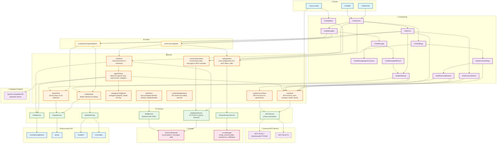

```mermaid
flowchart TB
    subgraph Routes["📍 Routes"]
        R1["/ (Welcome)"]
        R2["/chat/[id]"]
        RL["+layout.svelte"]
    end

    subgraph Components["🧩 Components"]
        C_Sidebar["ChatSidebar"]
        C_Screen["ChatScreen"]
        C_Form["ChatForm"]
        C_Messages["ChatMessages"]
        C_Message["ChatMessage"]
        C_ChatMessageAgenticContent["ChatMessageAgenticContent"]
        C_MessageEditForm["ChatMessageEditForm"]
        C_ModelsSelector["ModelsSelector"]
        C_Settings["ChatSettings"]
        C_McpSettings["McpServersSettings"]
        C_McpResourceBrowser["McpResourceBrowser"]
        C_McpServersSelector["McpServersSelector"]
    end

    subgraph Hooks["🪝 Hooks"]
        H1["useModelChangeValidation"]
        H2["useProcessingState"]
    end

    subgraph Stores["🗄️ Stores"]
        S1["chatStore<br/><i>Chat interactions & streaming</i>"]
        SA["agenticStore<br/><i>Multi-turn agentic loop, built-in tools, subagent</i>"]
        S2["conversationsStore<br/><i>Conversation data, messages & MCP overrides</i>"]
        S3["modelsStore<br/><i>Model selection & loading</i>"]
        S4["serverStore<br/><i>Server props & role detection</i>"]
        S5["settingsStore<br/><i>User configuration incl. MCP, filters, skills</i>"]
        S6["mcpStore<br/><i>MCP servers, tools, prompts, health checks</i>"]
        S7["mcpResourceStore<br/><i>MCP resources & attachments</i>"]
        S9["subagentConfigStore<br/><i>Subagent endpoint, model, API key</i>"]
        S10["skillsStore<br/><i>User-managed skill files (CRUD, enable/disable)</i>"]
        S11["modelCapabilityStore<br/><i>Per-model tool-calling override</i>"]
    end

    subgraph Services["⚙️ Services"]
        SV1["ChatService"]
        SV2["ModelsService"]
        SV3["PropsService"]
        SV4["DatabaseService<br/><i>HTTP API to SQLite backend</i>"]
        SV5["ParameterSyncService"]
        SV6["MCPService<br/><i>protocol operations</i>"]
        SV7["SkillService<br/><i>Backend skill CRUD</i>"]
    end

    subgraph Storage["💾 Storage"]
        ST1["SQLite (Backend)<br/><i>conversations, messages, skills</i>"]
        ST2["LocalStorage<br/><i>config, userOverrides, mcpServers, skillStates</i>"]
    end

    subgraph APIs["🌐 llama-server API"]
        API1["/v1/chat/completions"]
        API2["/props"]
        API3["/models/*"]
        API4["/v1/models"]
    end

    subgraph ExternalMCP["🔌 External MCP Servers"]
        EXT1["MCP Server 1<br/><i>WebSocket/HTTP/SSE</i>"]
        EXT2["MCP Server N"]
    end

    subgraph ExternalSubagent["🤖 Subagent Endpoint"]
        SUB1["OpenAI-compatible API<br/><i>(separate server)</i>"]
    end

    %% Routes → Components
    R1 & R2 --> C_Screen
    RL --> C_Sidebar

    %% Layout runs MCP health checks
    RL --> S6

    %% Component hierarchy
    C_Screen --> C_Form & C_Messages & C_Settings
    C_Messages --> C_Message
    C_Message --> C_ChatMessageAgenticContent
    C_Message --> C_MessageEditForm
    C_Form & C_MessageEditForm --> C_ModelsSelector
    C_Form --> C_McpServersSelector
    C_Settings --> C_McpSettings
    C_McpSettings --> C_McpResourceBrowser

    %% Components → Hooks → Stores
    C_Form & C_Messages --> H1 & H2
    H1 --> S3 & S4
    H2 --> S1 & S5

    %% Components → Stores
    C_Screen --> S1 & S2
    C_Sidebar --> S2
    C_ModelsSelector --> S3 & S4
    C_Settings --> S5
    C_McpSettings --> S6
    C_McpResourceBrowser --> S6 & S7
    C_McpServersSelector --> S6
    C_Form --> S6

    %% chatStore → agenticStore → mcpStore (agentic loop)
    S1 --> SA
    SA --> SV1
    SA --> S6
    SA --> S9
    SA --> SUB1

    %% Stores → Services
    S1 --> SV1 & SV4
    S2 --> SV4
    S3 --> SV2 & SV3
    S4 --> SV3
    S5 --> SV5
    S6 --> SV6
    S7 --> SV6
    S10 --> SV7

    %% Services → Storage
    SV4 --> ST1
    SV5 --> ST2
    SV7 --> ST1

    %% Services → APIs
    SV1 --> API1
    SV2 --> API3 & API4
    SV3 --> API2

    %% MCP → External Servers
    SV6 --> EXT1 & EXT2

    %% Styling
    classDef routeStyle fill:#e1f5fe,stroke:#01579b,stroke-width:2px
    classDef componentStyle fill:#f3e5f5,stroke:#7b1fa2,stroke-width:2px
    classDef hookStyle fill:#fff8e1,stroke:#ff8f00,stroke-width:2px
    classDef storeStyle fill:#fff3e0,stroke:#e65100,stroke-width:2px
    classDef serviceStyle fill:#e8f5e9,stroke:#2e7d32,stroke-width:2px
    classDef storageStyle fill:#fce4ec,stroke:#c2185b,stroke-width:2px
    classDef apiStyle fill:#e3f2fd,stroke:#1565c0,stroke-width:2px
    classDef mcpStyle fill:#e0f2f1,stroke:#00695c,stroke-width:2px
    classDef agenticStyle fill:#e8eaf6,stroke:#283593,stroke-width:2px
    classDef externalStyle fill:#f3e5f5,stroke:#6a1b9a,stroke-width:2px,stroke-dasharray: 5 5

    class R1,R2,RL routeStyle
    class C_Sidebar,C_Screen,C_Form,C_Messages,C_Message,C_ChatMessageAgenticContent,C_MessageEditForm,C_ModelsSelector,C_Settings componentStyle
    class C_McpSettings,C_McpResourceBrowser,C_McpServersSelector componentStyle
    class H1,H2 hookStyle
    class S1,S2,S3,S4,S5,SA,S6,S7,S9,S10,S11 storeStyle
    class SV1,SV2,SV3,SV4,SV5,SV6,SV7 serviceStyle
    class ST1,ST2 storageStyle
    class API1,API2,API3,API4 apiStyle
    class EXT1,EXT2 externalStyle
    class SUB1 externalStyle
```
