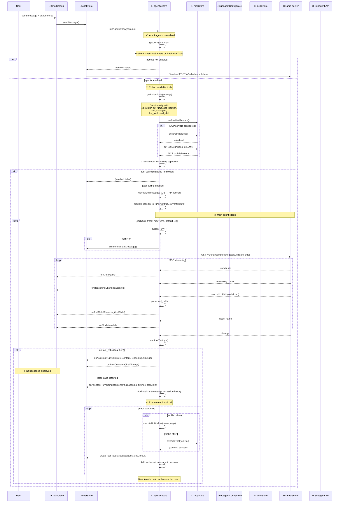
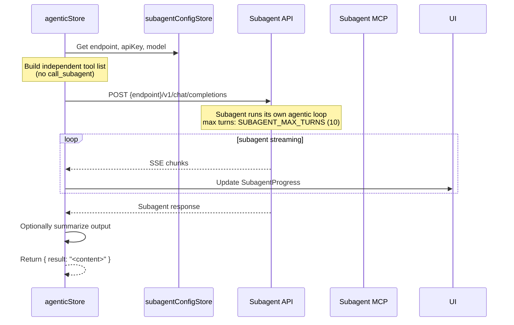

---

## Agentic Loop Details

### Overview

The agentic loop enables **multi-turn tool execution** where the LLM can call tools, receive results, and continue reasoning — all within a single user message. This is the core mechanism for MCP tool use, built-in tools, and subagent delegation.

### Configuration

```typescript
interface AgenticConfig {
	enabled: boolean; // true when MCP servers or built-in tools are available
	maxTurns: number; // default: 10, configurable in settings
	maxToolPreviewLines: number; // default: 40, for UI preview truncation
}
```

**Enable conditions** (any one):

- At least one MCP server is enabled
- At least one built-in tool is enabled
- Subagent is configured and enabled

### Session State

Each conversation has an independent `AgenticSession`:

```typescript
interface AgenticSession {
	isRunning: boolean;
	currentTurn: number;
	totalToolCalls: number;
	lastError: Error | null;
	streamingToolCall: { name: string; arguments: string } | null;
}
```

### Tool Categories

#### Built-in Tools (Frontend-Only)

| Tool            | Setting Key               | Description                                                                  |
| --------------- | ------------------------- | ---------------------------------------------------------------------------- |
| `calculator`    | `builtinToolCalculator`   | Evaluates JavaScript math expressions automatically with strict-mode sandbox |
| `get_time`      | `builtinToolTime`         | Returns current UTC date/time as ISO 8601 string                             |
| `get_location`  | `builtinToolLocation`     | Browser Geolocation API (requires user permission)                           |
| `call_subagent` | `builtinToolCallSubagent` | Delegate to separate model endpoint                                          |
| `list_skill`    | `builtinToolSkills`       | List enabled user skills                                                     |
| `read_skill`    | `builtinToolSkills`       | Read full skill content by name                                              |

Built-in tools are defined in `@shared/constants/prompts-and-tools.ts` and registered via `getBuiltinTools()` in `agenticStore`.

#### MCP Tools (External Servers)

MCP tools require an external MCP server connection. The `mcpStore` manages:

- Server connections (WebSocket, SSE, Streamable HTTP)
- Tool discovery and health checks
- Tool execution with timeout handling

### Built-in Tool Execution Details

**`calculator`**:

```typescript
// Automatically evaluates the expression in a strict-mode sandbox
const result = new Function(`"use strict"; return (${expression})`)();
if (typeof result !== 'number' || !isFinite(result)) {
	return 'Error: expression did not produce a finite number';
}
return String(result);
```

**`get_time`**:

```typescript
return { result: new Date().toISOString() };
```

**`get_location`**:

```typescript
return new Promise((resolve) => {
	navigator.geolocation.getCurrentPosition(
		(pos) => resolve({ result: { latitude, longitude, accuracy_meters } }),
		(err) => resolve({ error: err.message }),
		{ timeout: 10000 }
	);
});
```

**`list_skill`** and **`read_skill`**:

```typescript
// list_skill: returns enabled skills from skillsStore
return JSON.stringify(skillsStore.getListSkillEntries());

// read_skill: returns full skill content
const content = skillsStore.getReadSkillContent(name);
return content ?? 'Skill not found';
```

---

## Dual-Node Architecture (Subagent Delegation)

### Overview

The **dual-node architecture** separates the main model from a specialized subagent model running on a different endpoint. This enables:

- **Task offloading** — Heavy analysis, summarization, or data extraction
- **Independent model selection** — Subagent can use a different model
- **Separate configuration** — Endpoint, API key, and model are configured independently

### Subagent Configuration

Configured in **Settings → Connection** → Subagent section:

| Setting             | Storage        | Description                               |
| ------------------- | -------------- | ----------------------------------------- |
| Enable subagent     | `localStorage` | Gates tool registration                   |
| Endpoint URL        | `localStorage` | Base URL of subagent server               |
| API key             | `localStorage` | Optional, separate from main API          |
| Model               | `localStorage` | Populated from `GET {endpoint}/v1/models` |
| Summarize long text | `localStorage` | Summarize subagent output if too long     |

**Store**: `subagentConfigStore` (`src/lib/stores/subagent-config.svelte.ts`)

- Persists to `localStorage` under `SUBAGENT_CONFIG_LOCALSTORAGE_KEY`
- `isConfigured` requires both `endpoint` and `model` to be non-empty
- Explicitly isolated from main `apiConfigStore`

### Subagent Tool Execution

When `call_subagent` is invoked:



**Key constraints:**

- **No recursion** — Subagent does NOT get `call_subagent` tool
- **MCP tools** — Subagent CAN use MCP tools if servers are configured
- **Built-in tools** — Subagent gets calculator, time, location, list_skill, read_skill
- **Max turns** — `SUBAGENT_MAX_TURNS = 10` (independent of main model's turn limit)

### Subagent Progress Tracking

The UI shows real-time subagent progress:

```typescript
interface SubagentProgress {
	modelName: string;
	steps: SubagentStep[]; // { toolName, status: 'calling' | 'done' }
	originSkill?: string; // Skill that triggered this invocation
}
```

Tracked via `_subagentProgress` in `agenticStore`, reactively bound to UI components.

### Skill-Subagent Association

When the main model calls `read_skill` followed by `call_subagent`, the `_lastReadSkill` field tracks which skill triggered the subagent:

```typescript
// In read_skill execution:
agenticStore._lastReadSkill = name;

// In call_subagent execution:
const originSkill = agenticStore.getLastReadSkill();
agenticStore.clearLastReadSkill();
// Pass originSkill to SubagentProgress for UI display
```

---

## MCP Response Length Harness

When MCP tool output exceeds a configurable line threshold:

1. **Detection** — Output line count > `mcpSummarizeLineThreshold` (default: 400)
2. **Summarization** — Subagent summarizes the output using `TOOL_OUTPUT_SUMMARIZER_PROMPT`
3. **Hard cap** — If still too long, truncate at `mcpSummarizeHardCap` (default: 800 lines)
4. **Return** — Summarized (or truncated) content returned to main model

**Settings:**

- `mcpSummarizeOutputs` — Enable summarization
- `mcpSummarizeLineThreshold` — Lines before summarization triggers
- `mcpSummarizeHardCap` — Absolute maximum lines
- `mcpSummarizeAllTools` — Summarize all tools, not just MCP tools

---

## Context Compaction

For very long conversations, the agentic flow supports **message tree compaction**:

1. **Trigger** — Message count exceeds threshold
2. **Summary** — Subagent (or main model) summarizes early messages
3. **Replacement** — Early messages replaced with summary in context
4. **Continuation** — Model continues with compacted context

The compaction system uses `COMPACT_SUMMARIZER_BASE_PROMPT` and can incorporate previous compaction summaries for continuity.

---

## Error Handling

| Scenario                      | Behavior                                                                       |
| ----------------------------- | ------------------------------------------------------------------------------ |
| LLM stream error              | Error content saved to message, flow continues                                 |
| Tool execution error          | Error message returned as tool result                                          |
| Subagent endpoint unreachable | Toast warning, tool disabled, flow continues                                   |
| MCP server disconnect         | Health check detects failure, tools unavailable                                |
| Abort (user cancel)           | Flow exits immediately, saves partial state                                    |
| Turn limit exceeded           | Flow completes with current state, no error                                    |
| Malformed tool arguments      | Heuristically repaired before execution; unrecoverable JSON falls back to `{}` |

---

## Files

| File                                       | Purpose                                      |
| ------------------------------------------ | -------------------------------------------- |
| `src/lib/stores/agentic.svelte.ts`         | Main agentic loop orchestration (1323 lines) |
| `src/lib/stores/subagent-config.svelte.ts` | Subagent endpoint configuration              |
| `src/lib/stores/mcp.svelte.ts`             | MCP connection management and tool execution |
| `@shared/constants/prompts-and-tools.ts`   | Built-in tool definitions and prompts        |
| `src/lib/services/chat.service.ts`         | Stateless API layer (sendMessage, streaming) |
