```mermaid
sequenceDiagram
    participant Store as 🗄️ Stores
    participant DbSvc as ⚙️ DatabaseService
    participant Backend as 🖥️ Backend API
    participant SQLite as 💾 SQLite (bun:sqlite)

    Note over DbSvc: Stateless service - all methods static<br/>Delegates to backend via HTTP API<br/>Maintains Dexie-compatible API surface

    %% ═══════════════════════════════════════════════════════════════════════════
    Note over Store,SQLite: 📊 SCHEMA
    %% ═══════════════════════════════════════════════════════════════════════════

    rect rgb(240, 248, 255)
        Note over SQLite: conversations table:<br/>id (PK), lastModified, currNode, name
    end

    rect rgb(255, 248, 240)
        Note over SQLite: messages table:<br/>id (PK), convId (FK), type, role, timestamp,<br/>parent, children[], content, thinking,<br/>toolCalls, extra[], model, timings
    end

    %% ═══════════════════════════════════════════════════════════════════════════
    Note over Store,SQLite: 💬 CONVERSATIONS CRUD
    %% ═══════════════════════════════════════════════════════════════════════════

    Store->>DbSvc: createConversation(name)
    activate DbSvc
    DbSvc->>DbSvc: Generate UUID
    DbSvc->>Backend: POST /api/conversations {id, name, lastModified, currNode: ""}
    Backend->>SQLite: INSERT INTO conversations
    SQLite-->>Backend: success
    Backend-->>DbSvc: DatabaseConversation
    DbSvc-->>Store: DatabaseConversation
    deactivate DbSvc

    Store->>DbSvc: getConversation(convId)
    DbSvc->>Backend: GET /api/conversations/{convId}
    Backend->>SQLite: SELECT * FROM conversations WHERE id = ?
    SQLite-->>Backend: DatabaseConversation
    Backend-->>DbSvc: DatabaseConversation

    Store->>DbSvc: getAllConversations()
    DbSvc->>Backend: GET /api/conversations
    Backend->>SQLite: SELECT * FROM conversations ORDER BY lastModified DESC
    SQLite-->>Backend: DatabaseConversation[]
    Backend-->>DbSvc: DatabaseConversation[]

    Store->>DbSvc: updateConversation(convId, updates)
    DbSvc->>Backend: PUT /api/conversations/{convId} {updates, lastModified}
    Backend->>SQLite: UPDATE conversations SET ... WHERE id = ?

    Store->>DbSvc: deleteConversation(convId)
    activate DbSvc
    DbSvc->>Backend: DELETE /api/conversations/{convId}
    Backend->>SQLite: DELETE FROM conversations WHERE id = ?
    Backend->>SQLite: DELETE FROM messages WHERE convId = ?
    deactivate DbSvc

    %% ═══════════════════════════════════════════════════════════════════════════
    Note over Store,SQLite: 📝 MESSAGES CRUD
    %% ═══════════════════════════════════════════════════════════════════════════

    Store->>DbSvc: createRootMessage(convId)
    activate DbSvc
    DbSvc->>DbSvc: Create root message {type: "root", parent: null}
    DbSvc->>Backend: POST /api/messages {rootMsg}
    Backend->>SQLite: INSERT INTO messages
    Backend-->>DbSvc: messageId
    DbSvc-->>Store: rootMessageId
    deactivate DbSvc

    Store->>DbSvc: createSystemMessage(convId, content, parentId)
    activate DbSvc
    DbSvc->>DbSvc: Create message {role: "system", parent: parentId}
    DbSvc->>Backend: POST /api/messages {systemMsg}
    Backend->>SQLite: INSERT INTO messages
    Backend-->>DbSvc: DatabaseMessage
    DbSvc-->>Store: DatabaseMessage
    deactivate DbSvc

    Store->>DbSvc: createMessageBranch(message, parentId)
    activate DbSvc
    DbSvc->>DbSvc: Generate UUID for new message
    DbSvc->>Backend: POST /api/messages {message, parent: parentId}
    Backend->>SQLite: INSERT INTO messages

    alt parentId exists
        Backend->>SQLite: SELECT * FROM messages WHERE id = parentId
        DbSvc->>DbSvc: parent.children.push(newId)
        Backend->>SQLite: UPDATE messages SET children = ? WHERE id = parentId
    end

    Backend->>SQLite: UPDATE conversations SET currNode = ? WHERE id = convId
    Backend-->>DbSvc: DatabaseMessage
    DbSvc-->>Store: DatabaseMessage
    deactivate DbSvc

    Store->>DbSvc: getConversationMessages(convId)
    DbSvc->>Backend: GET /api/messages?convId={convId}
    Backend->>SQLite: SELECT * FROM messages WHERE convId = ?
    SQLite-->>Backend: DatabaseMessage[]
    Backend-->>DbSvc: DatabaseMessage[]

    Store->>DbSvc: updateMessage(msgId, updates)
    DbSvc->>Backend: PUT /api/messages/{msgId} {updates}
    Backend->>SQLite: UPDATE messages SET ... WHERE id = ?

    Store->>DbSvc: deleteMessage(msgId)
    DbSvc->>Backend: DELETE /api/messages/{msgId}
    Backend->>SQLite: DELETE FROM messages WHERE id = ?

    %% ═══════════════════════════════════════════════════════════════════════════
    Note over Store,SQLite: 🌳 BRANCHING OPERATIONS
    %% ═══════════════════════════════════════════════════════════════════════════

    Store->>DbSvc: updateCurrentNode(convId, nodeId)
    DbSvc->>Backend: PUT /api/conversations/{convId}/node {nodeId, lastModified}
    Backend->>SQLite: UPDATE conversations SET currNode = ?, lastModified = ? WHERE id = ?

    Store->>DbSvc: deleteMessageCascading(msgId)
    activate DbSvc
    DbSvc->>DbSvc: findDescendantMessages(msgId, allMessages)
    Note right of DbSvc: Recursively find all children
    loop each descendant
        DbSvc->>Backend: DELETE /api/messages/{descendantId}
        Backend->>SQLite: DELETE FROM messages WHERE id = ?
    end
    DbSvc->>Backend: DELETE /api/messages/{msgId}
    Backend->>SQLite: DELETE FROM messages WHERE id = ?

    alt target message has a parent
        Backend->>SQLite: SELECT * FROM messages WHERE id = parentId
        DbSvc->>DbSvc: parent.children.filter(id !== msgId)
        Backend->>SQLite: UPDATE messages SET children = ? WHERE id = parentId
        Note right of DbSvc: Remove deleted message from parent's children[]
    end
    deactivate DbSvc

    %% ═══════════════════════════════════════════════════════════════════════════
    Note over Store,SQLite: 📥 IMPORT
    %% ═══════════════════════════════════════════════════════════════════════════

    Store->>DbSvc: importConversations(data)
    activate DbSvc
    loop each conversation in data
        DbSvc->>Backend: GET /api/conversations/{conv.id}
        alt conversation already exists
            Note right of DbSvc: Skip duplicate (keep existing)
        else conversation is new
            DbSvc->>Backend: POST /api/conversations {conversation}
            Backend->>SQLite: INSERT INTO conversations
            loop each message
                DbSvc->>Backend: POST /api/messages {message}
                Backend->>SQLite: INSERT INTO messages
            end
        end
    end
    deactivate DbSvc

    %% ═══════════════════════════════════════════════════════════════════════════
    Note over Store,SQLite: 🔗 MESSAGE TREE UTILITIES
    %% ═══════════════════════════════════════════════════════════════════════════

    Note over DbSvc: Used by stores (imported from utils):

    rect rgb(240, 255, 240)
        Note over DbSvc: filterByLeafNodeId(messages, leafId)<br/>→ Returns path from root to leaf<br/>→ Used to display current branch
    end

    rect rgb(240, 255, 240)
        Note over DbSvc: findLeafNode(startId, messages)<br/>→ Traverse to deepest child<br/>→ Used for branch navigation
    end

    rect rgb(240, 255, 240)
        Note over DbSvc: findDescendantMessages(msgId, messages)<br/>→ Find all children recursively<br/>→ Used for cascading deletes
    end
```

---

## Architecture Notes

### Migration from Dexie (IndexedDB) to SQLite

The frontend previously used **Dexie** (IndexedDB ORM) for client-side storage. This has been **migrated to a server-side SQLite backend** using Bun's native `bun:sqlite` module.

**Key changes:**

| Aspect | Before (Dexie) | After (SQLite) |
|---|---|---|
| **Storage location** | Browser IndexedDB | Server-side SQLite file |
| **Access method** | Direct browser API | HTTP requests to backend |
| **ORM layer** | Dexie (chainable queries) | `DatabaseService` compatibility layer |
| **Data persistence** | Per-browser, cleared on cache wipe | Persistent across browsers/devices |
| **Concurrency** | Single-browser only | Multi-user, multi-device safe |

### DatabaseService Compatibility Layer

The `DatabaseService` (`src/lib/services/database.service.ts`) maintains the **same API surface** as the old Dexie-based implementation. This means:

- **Stores require no changes** — `conversationsStore`, `chat.svelte.ts`, etc. call the same methods
- **Method signatures unchanged** — `createConversation()`, `getConversation()`, `getAllConversations()`, etc.
- **Dexie emulation** — The service also exports a `db` object that emulates Dexie's chainable API (`db.conversations.add()`, `db.messages.where().toArray()`, etc.) for any legacy code

### Backend Implementation

The backend uses **Bun's native `bun:sqlite`** module (not `better-sqlite3`):

- **Database initialization**: `packages/backend/src/database/index.ts` — Opens SQLite with WAL mode
- **Schema definitions**: `packages/backend/src/database/schema.ts` — Table structures
- **Query modules**: 
  - `packages/backend/src/database/queries/conversations.ts` — Conversation CRUD
  - `packages/backend/src/database/queries/messages.ts` — Message operations with tree/branching support

### Backend API Endpoints

| Method | Endpoint | Purpose |
|---|---|---|
| `GET` | `/api/conversations` | List all conversations |
| `GET` | `/api/conversations/:id` | Get single conversation |
| `POST` | `/api/conversations` | Create conversation |
| `PUT` | `/api/conversations/:id` | Update conversation |
| `DELETE` | `/api/conversations/:id` | Delete conversation (cascades to messages) |
| `PUT` | `/api/conversations/:id/node` | Update current branch node |
| `GET` | `/api/messages?convId=X` | Get messages for conversation |
| `POST` | `/api/messages` | Create message |
| `PUT` | `/api/messages/:id` | Update message |
| `DELETE` | `/api/messages/:id` | Delete message |

### Data Flow

```
Frontend Store → DatabaseService (HTTP) → Backend API → SQLite (bun:sqlite)
                  ↑                                                    |
                  └────────────── Response ◄──────────────────────────┘
```
