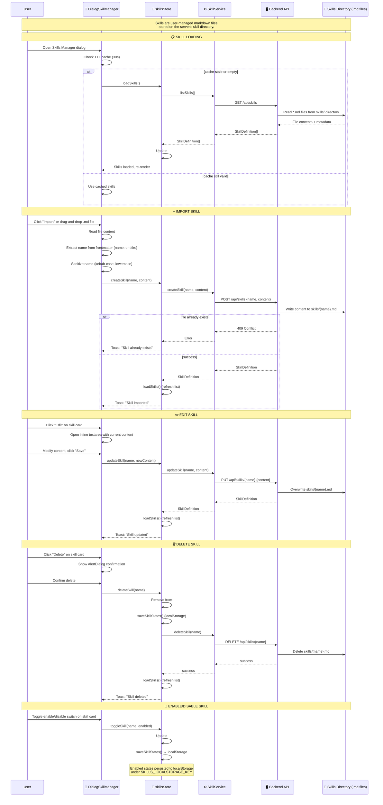

---

## Skill Architecture

### Overview

Skills are **user-managed Markdown files** that extend the model's capabilities. They are stored on the server as `.md` files with optional YAML frontmatter metadata. The model can discover and read skills via built-in tools (`list_skill`, `read_skill`).

### Skill File Format

```markdown
---
title: My Custom Skill
name: my-cool-skill
context: fork
userInvocable: true
disableModelInvocation: false
---

# Instructions

Here are the detailed instructions for this skill.

The model can reference $ARGUMENTS[0], $ARGUMENTS[1], etc.
for parameterized behavior.
```

### Frontmatter Fields

| Field | Type | Default | Description |
|---|---|---|---|
| `title` | string | *(derived from filename)* | Human-readable display name |
| `name` | string | *(derived from title/filename)* | Unique identifier (kebab-case) |
| `context` | `'fork'` | — | Reserved for future use |
| `userInvocable` | boolean | `true` | Whether the user can directly invoke |
| `disableModelInvocation` | boolean | `false` | If true, skill is hidden from the model |

### Skill Types and Constants

**Shared types:** `@shared/types/skills.ts`
```typescript
interface SkillFrontmatter {
  context?: 'fork';
  userInvocable?: boolean;
  disableModelInvocation?: boolean;
}

interface SkillDefinition {
  name: string;
  title: string;
  description: string;  // Extracted from first heading or frontmatter
  content: string;       // Full markdown content
  frontmatter: SkillFrontmatter;
}
```

**Shared constants:** `@shared/constants/skills.ts`
```typescript
SKILLS_DIRECTORY = 'skills'
SKILL_FILE_EXTENSION = '.md'
SKILL_ARGUMENTS_PATTERN = /\$ARGUMENTS\[(\d+)\]/g

function sanitizeSkillName(name: string): string
// Converts to kebab-case, lowercase, strips invalid characters
```

---

## skillsStore

**File:** `src/lib/stores/skills.svelte.ts`

### State

```typescript
class SkillsStore {
  #skills: SkillDefinition[];          // Loaded skills
  #skillStates: Record<string, { enabled: boolean }>;  // Enabled states
  #isLoading: boolean;
  #error: string | null;
}
```

### Key Getters

| Getter | Returns | Description |
|---|---|---|
| `skills` | `SkillDefinition[]` | All loaded skills |
| `enabledSkills` | `SkillDefinition[]` | Only enabled skills |
| `modelVisibleSkills` | `SkillDefinition[]` | Enabled AND `!disableModelInvocation` |

### CRUD Operations

| Method | Description |
|---|---|
| `loadSkills()` | Fetch all skills from backend |
| `createSkill(name, content)` | Create new skill, refresh list |
| `updateSkill(name, content)` | Update existing skill, refresh list |
| `deleteSkill(name)` | Delete skill, clean state, refresh list |
| `findSkill(name)` | Find by name (sync, from cache) |

### Tool Integration

| Method | Used By | Description |
|---|---|---|
| `getListSkillEntries()` | `list_skill` tool | Returns enabled, model-visible skills as `{name, title, description}` |
| `getReadSkillContent(name)` | `read_skill` tool | Returns full content by name |
| `isSkillAvailableForModel(name)` | Tool filtering | Checks enabled + visible to model |

### Persistence

**Skill enabled states** are persisted to `localStorage` under `SKILLS_LOCALSTORAGE_KEY`:
```json
{
  "my-cool-skill": { "enabled": true },
  "another-skill": { "enabled": false }
}
```

**Default behavior:** Skills are **enabled by default** if no state is stored.

---

## Skill Vault Manager UI

**File:** `src/lib/components/app/dialogs/DialogSkillManager.svelte`

### Features

| Feature | Description |
|---|---|
| **Search** | Filter by title, name, or description |
| **Sort** | Recently Modified, Name (A-Z), Enabled then Name |
| **Import** | Upload `.md` files via drag-and-drop or file picker |
| **Create** | New skill with name + content textarea |
| **Edit** | Inline markdown editor for existing skills |
| **Preview** | Render with MarkdownContent before saving |
| **Delete** | AlertDialog confirmation required |
| **Duplicate** | Clone skill as `{name}-copy` |
| **Enable/Disable** | Per-skill toggle |
| **TTL Caching** | 30-second cache to avoid redundant loads |
| **Badges** | Total count, enabled count, max 1 MB per skill |

### UI States

| State | Display |
|---|---|
| Loading | Skeleton cards with spinner |
| Error | Error message + Retry button |
| Empty | "No skills yet" + Import CTA |
| Search no match | "No skills match your search" |
| Edit mode | Inline textarea with Save/Cancel |
| Preview mode | MarkdownContent render with Back button |

### Import Flow

1. User uploads `.md` file (drag-and-drop or click)
2. File content read via `FileReader`
3. Name auto-extracted from frontmatter (`name:` or `title:` field)
4. Falls back to sanitized filename
5. POST to backend, conflict check
6. Refresh skill list on success

---

## Built-in Tool Integration

### `list_skill`

**Tool definition:**
```typescript
{
  name: 'list_skill',
  description: 'List all available user-enabled skills...',
  parameters: { type: 'object', properties: {} }
}
```

**Execution:**
```typescript
const entries = skillsStore.getListSkillEntries();
return JSON.stringify(entries);
// Returns: [{ name, title, description, disableModelInvocation }]
```

Only returns skills that are:
1. **Enabled** (per localStorage state)
2. **Model-visible** (`!disableModelInvocation`)

### `read_skill`

**Tool definition:**
```typescript
{
  name: 'read_skill',
  description: 'Read the full content of a specific skill by name...',
  parameters: {
    type: 'object',
    properties: {
      name: { type: 'string', description: 'Skill name from list_skill results' }
    },
    required: ['name']
  }
}
```

**Execution:**
```typescript
const content = skillsStore.getReadSkillContent(name);
return content ?? 'Skill not found';
```

Also tracks `_lastReadSkill` in `agenticStore` for subagent association.

---

## $ARGUMENTS Pattern

Skills can include parameterized placeholders:

```markdown
$ARGUMENTS[0]  — First argument
$ARGUMENTS[1]  — Second argument
```

Detected via `SKILL_ARGUMENTS_PATTERN = /\$ARGUMENTS\[(\d+)\]/g`.

The `skillHasArguments()` utility (`src/lib/services/skill-utils.ts`) checks for this pattern, and the UI displays a `$ARGUMENTS` badge on skills that use it.

---

## Backend API

| Method | Endpoint | Purpose |
|---|---|---|
| `GET` | `/api/skills` | List all skills (reads `.md` files from skills directory) |
| `POST` | `/api/skills` | Create new skill (writes `.md` file) |
| `PUT` | `/api/skills/:name` | Update existing skill (overwrites `.md` file) |
| `DELETE` | `/api/skills/:name` | Delete skill (removes `.md` file) |

**Backend handler:** `packages/backend/src/handlers/skills.ts`

Skills are stored as individual `.md` files in the `skills/` directory (configured via `SKILLS_DIRECTORY` constant).

---

## Files

| File | Purpose |
|---|---|
| `src/lib/stores/skills.svelte.ts` | Reactive skill store (CRUD, enable/disable, tool integration) |
| `src/lib/services/skill.service.ts` | Backend API client for skill operations |
| `src/lib/components/app/dialogs/DialogSkillManager.svelte` | Full CRUD management UI |
| `src/lib/components/app/SkillCard.svelte` | Individual skill card component |
| `@shared/types/skills.ts` | Shared TypeScript types |
| `@shared/constants/skills.ts` | Shared constants (pattern, directory, sanitize function) |
| `@shared/constants/prompts-and-tools.ts` | `list_skill` and `read_skill` tool definitions |
| `packages/backend/src/handlers/skills.ts` | Backend HTTP handler for skill CRUD |
