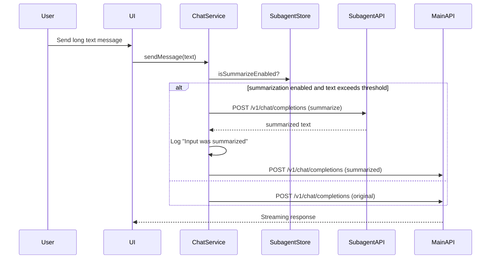
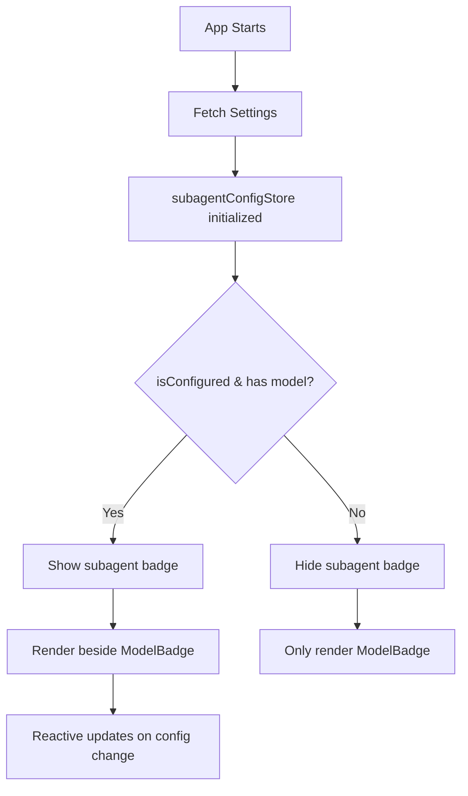

# Subagent Feature — Implementation Plan

> Status: **Ready to code** — all decisions recorded. Do not re-ask them.

---

## User decisions (confirmed)

| Question                      | Answer                                                                                                                             |
| ----------------------------- | ---------------------------------------------------------------------------------------------------------------------------------- |
| Tool name                     | `call_subagent`                                                                                                                    |
| Subagent behavior             | Claude Code-style delegation — main model decides when to invoke; tool description biases toward long docs, reports, summarization |
| Subagent protocol             | OpenAI-compatible `/v1/chat/completions` (same as main endpoint)                                                                   |
| Subagent location             | Separate machine, configured via its own endpoint in Settings → Developer                                                          |
| Subagent API key              | Separate from main endpoint's key                                                                                                  |
| Subagent model selector       | Yes — fetched from subagent endpoint's `/v1/models`                                                                                |
| Connection status bugs        | Fix as encountered during implementation                                                                                           |
| Toggle to enable/disable tool | Yes — `subagentEnabled` checkbox gates everything                                                                                  |
| Subagent badge position       | Beside main ModelBadge in ChatFormTextarea                                                                                         |
| Token counting method         | Use existing tokenizer (add if not present)                                                                                        |
| Summarization prompt          | Generic concise: "You are a summarization expert. Provide concise, accurate summaries."                                            |
| Toggle placement              | Same Developer tab                                                                                                                 |

---

## Overview

**Five** coordinated changes:

1. **`call_subagent` built-in tool** — new entry in `agentic.svelte.ts` alongside `get_time`, `get_location`, etc.
2. **Subagent settings block** — new group inside the existing Developer tab.
3. **Subagent model badge** — secondary badge displayed beside main ModelBadge in ChatFormTextarea.
4. **Long text summarization workflow** — automatic summarization of text exceeding threshold using subagent.
5. **Connection status bug fixes** — identified during code audit, fixed in-place.

---

## 1. Settings layer

### 1a. New keys — `src/lib/constants/settings-keys.ts`

Add under the `// Developer` comment block:

```typescript
SUBAGENT_ENABLED:           'subagentEnabled',
SUBAGENT_ENDPOINT:         'subagentEndpoint',
SUBAGENT_API_KEY:          'subagentApiKey',
SUBAGENT_MODEL:            'subagentModel',
SUBAGENT_SUMMARIZE_ENABLED: 'subagentSummarizeEnabled',
```

### 1b. Defaults — `src/lib/constants/settings-config.ts`

Add to `SETTING_CONFIG_DEFAULT`:

```typescript
subagentEnabled:          false,
subagentEndpoint:        '',
subagentApiKey:         '',
subagentModel:           '',
subagentSummarizeEnabled: false,
```

Add to `SETTING_CONFIG_INFO`:

```typescript
subagentEnabled:
  'Enable the call_subagent built-in tool. Requires a separate subagent endpoint to be configured below.',
subagentEndpoint:
  'Base URL of the subagent server (OpenAI-compatible). Example: http://192.168.1.10:8080',
subagentApiKey:
  'API key for the subagent server. Leave blank if the server has no key set.',
subagentModel:
  'Model to use on the subagent server. Populated from the subagent endpoint\'s /v1/models list.',
subagentSummarizeEnabled:
  'When enabled, long text content exceeding the token threshold will be summarized by the subagent before being passed to the main model. Requires subagent to be configured.',
```

### 1c. Settings sections — `src/lib/constants/settings-sections.ts`

No new top-level section. Subagent lives inside **Developer** as a visual sub-group (see UI section below).

---

## 2. Subagent config store — `src/lib/stores/subagent-config.svelte.ts` (new file)

Mirrors the shape of `api-config.svelte.ts` but reads from the subagent keys.  
Keeps the subagent endpoint concerns fully isolated from the main `apiConfigStore`.

```typescript
import { settingsStore } from './settings.svelte';
import { SETTINGS_KEYS } from '$lib/constants/settings-keys';

export type SubagentConnectionStatus = 'idle' | 'connecting' | 'connected' | 'error';

class SubagentConfigStore {
	connectionStatus = $state<SubagentConnectionStatus>('idle');
	lastError = $state<string | null>(null);
	availableModels = $state<string[]>([]);

	get endpoint(): string {
		return settingsStore.config.subagentEndpoint?.trim() ?? '';
	}

	get apiKey(): string | null {
		const k = settingsStore.config.subagentApiKey?.toString().trim() ?? '';
		return k.length > 0 ? k : null;
	}

	get model(): string {
		return settingsStore.config.subagentModel?.toString() ?? '';
	}

	get isConfigured(): boolean {
		return this.endpoint.length > 0;
	}

	get isSummarizeEnabled(): boolean {
		return this.isConfigured && settingsStore.config.subagentSummarizeEnabled === true;
	}

	get headers(): Record<string, string> {
		const key = this.apiKey;
		return key ? { Authorization: `Bearer ${key}` } : {};
	}

	getUrl(path: string): string {
		let base = this.endpoint;
		if (!base.startsWith('http://') && !base.startsWith('https://')) {
			base = `http://${base}`;
		}
		return new URL(path, base).toString();
	}

	async fetchModels(): Promise<void> {
		if (!this.isConfigured) return;
		this.connectionStatus = 'connecting';
		this.lastError = null;
		try {
			const res = await fetch(this.getUrl('/v1/models'), {
				headers: { 'Content-Type': 'application/json', ...this.headers }
			});
			if (!res.ok) throw new Error(`HTTP ${res.status}`);
			const data = await res.json();
			this.availableModels = (data.data ?? []).map((m: { id: string }) => m.id);
			this.connectionStatus = 'connected';
		} catch (e) {
			this.lastError = e instanceof Error ? e.message : 'Unknown error';
			this.connectionStatus = 'error';
			this.availableModels = [];
		}
	}

	setModel(modelId: string): void {
		settingsStore.updateConfig(SETTINGS_KEYS.SUBAGENT_MODEL, modelId);
	}

	reset(): void {
		this.connectionStatus = 'idle';
		this.lastError = null;
		this.availableModels = [];
	}
}

export const subagentConfigStore = new SubagentConfigStore();
```

---

## 3. Token counter utility — `src/lib/utils/tokenizer.ts` (new file)

A simple tokenizer utility for estimating token count. Uses character-based estimation (~4 chars per token) as a conservative approximation.

```typescript
const CHARS_PER_TOKEN = 4;

export function estimateTokens(text: string): number {
	if (!text || text.length === 0) return 0;
	return Math.ceil(text.length / CHARS_PER_TOKEN);
}

export function getTextThreshold(): number {
	const stored = localStorage.getItem('pasteLongTextToFileLen');
	if (stored) {
		const parsed = parseInt(stored, 10);
		if (!isNaN(parsed) && parsed > 0) return parsed;
	}
	return 2500;
}

export function shouldSummarize(text: string): boolean {
	const threshold = getTextThreshold();
	const tokenCount = estimateTokens(text);
	return tokenCount >= threshold;
}
```

---

## 4. `call_subagent` tool

### 4a. Tool definition — `src/lib/stores/agentic.svelte.ts`

Add after `TOOL_GET_LOCATION` (line ~151):

```typescript
const TOOL_CALL_SUBAGENT: OpenAIToolDefinition = {
	type: 'function',
	function: {
		name: 'call_subagent',
		description: `Delegate a task to a specialized subagent model running on a separate server for faster parallel processing.

USE THIS TOOL for:
- Long document analysis, summarization, or data extraction (content longer than ~500 words)
- Structured report generation that can be described in a self-contained prompt
- Computationally heavy analytical tasks where offloading provides speed benefits
- Any prompt that does NOT require the current conversation history to answer correctly

DO NOT use for short replies, clarifying questions, or tasks that need context from this conversation.

The subagent has no access to the current conversation. Your prompt must be fully self-contained.
Return the subagent's response verbatim or incorporate it into your final answer.`,
		parameters: {
			type: 'object',
			properties: {
				prompt: {
					type: 'string',
					description:
						'A complete, self-contained prompt for the subagent. Include all necessary context — the subagent sees only this prompt.'
				},
				system: {
					type: 'string',
					description:
						'Optional system prompt that customises subagent behaviour for this specific task (e.g. "You are a summarization expert. Be concise.").'
				}
			},
			required: ['prompt']
		}
	}
};
```

### 4b. Register in `getBuiltinTools()` — same file, around line 275

```typescript
if (settingsStore.config.personalizationToolTime) tools.push(TOOL_GET_TIME);
if (settingsStore.config.personalizationToolLocation) tools.push(TOOL_GET_LOCATION);

if (settingsStore.config.subagentEnabled && subagentConfigStore.isConfigured) {
	tools.push(TOOL_CALL_SUBAGENT);
}
```

### 4c. Execution in `executeBuiltinTool()` — same file, around line 716

Add a `case 'call_subagent':` branch:

```typescript
case 'call_subagent': {
  const { prompt, system } = args as { prompt: string; system?: string };

  if (!subagentConfigStore.isConfigured) {
    return { error: 'Subagent is not configured. Set the subagent endpoint in Settings → Developer.' };
  }

  const messages: { role: string; content: string }[] = [];
  if (system?.trim()) {
    messages.push({ role: 'system', content: system.trim() });
  }
  messages.push({ role: 'user', content: prompt });

  const model = subagentConfigStore.model || undefined;

  const body: Record<string, unknown> = { messages, stream: false };
  if (model) body.model = model;

  const res = await fetch(subagentConfigStore.getUrl('/v1/chat/completions'), {
    method: 'POST',
    headers: { 'Content-Type': 'application/json', ...subagentConfigStore.headers },
    body: JSON.stringify(body)
  });

  if (!res.ok) {
    const text = await res.text().catch(() => '');
    return { error: `Subagent returned HTTP ${res.status}: ${text}` };
  }

  const data = await res.json();
  const content = data?.choices?.[0]?.message?.content ?? '';
  if (!content) return { error: 'Subagent returned an empty response.' };

  return { result: content };
}
```

### 4d. Direct summarization method — `src/lib/services/subagent.service.ts` (new file)

Service for long text summarization. Used by chat service when threshold is exceeded.

```typescript
import { subagentConfigStore } from '$lib/stores/subagent-config.svelte';

const DEFAULT_SUMMARIZE_SYSTEM_PROMPT =
	'You are a summarization expert. Provide concise, accurate summaries that preserve the key information and intent of the original text.';

export interface SummarizeResult {
	success: boolean;
	summary?: string;
	error?: string;
}

export async function summarizeText(
	text: string,
	customSystemPrompt?: string
): Promise<SummarizeResult> {
	if (!subagentConfigStore.isConfigured) {
		return { success: false, error: 'Subagent is not configured' };
	}

	const systemPrompt = customSystemPrompt?.trim() || DEFAULT_SUMMARIZE_SYSTEM_PROMPT;
	const userPrompt = `Please summarize the following text concisely while preserving the key information and intent:\n\n${text}`;

	const messages = [
		{ role: 'system', content: systemPrompt },
		{ role: 'user', content: userPrompt }
	];

	const model = subagentConfigStore.model || undefined;
	const body: Record<string, unknown> = { messages, stream: false };
	if (model) body.model = model;

	try {
		const res = await fetch(subagentConfigStore.getUrl('/v1/chat/completions'), {
			method: 'POST',
			headers: { 'Content-Type': 'application/json', ...subagentConfigStore.headers },
			body: JSON.stringify(body)
		});

		if (!res.ok) {
			const errorText = await res.text().catch(() => '');
			console.error('[Subagent] Summarization failed:', res.status, errorText);
			return { success: false, error: `Subagent HTTP ${res.status}: ${errorText}` };
		}

		const data = await res.json();
		const content = data?.choices?.[0]?.message?.content ?? '';

		if (!content) {
			return { success: false, error: 'Subagent returned an empty response' };
		}

		return { success: true, summary: content };
	} catch (e) {
		const errorMessage = e instanceof Error ? e.message : 'Unknown error';
		console.error('[Subagent] Summarization error:', errorMessage);
		return { success: false, error: errorMessage };
	}
}
```

---

## 5. Settings UI — Developer tab

**File:** `src/lib/components/app/chat/ChatSettings/ChatSettings.svelte`  
**Target:** the existing Developer section's `fields` array (lines 386–417).

### 5a. Add a visual separator + subagent sub-group

Inside the `{#if currentSection.title === SETTINGS_SECTION_TITLES.DEVELOPER}` block (or equivalent render logic), append **after** the existing rendered fields:

```svelte
<!-- Subagent sub-group -->
<div class="border-t pt-4">
	<h4 class="mb-3 text-sm font-semibold tracking-wide text-muted-foreground uppercase">Subagent</h4>

	<!-- Enable toggle -->
	<SettingsFieldCheckbox
		label="Enable subagent tool (call_subagent)"
		description={SETTING_CONFIG_INFO.subagentEnabled}
		bind:value={localConfig.subagentEnabled}
	/>

	{#if localConfig.subagentEnabled}
		<!-- Endpoint -->
		<SettingsFieldApiEndpoint
			label="Subagent API Endpoint"
			description={SETTING_CONFIG_INFO.subagentEndpoint}
			bind:value={localConfig.subagentEndpoint}
			onBlur={() => subagentConfigStore.fetchModels()}
		/>

		<!-- API Key -->
		<SettingsFieldInput
			label="Subagent API Key"
			description={SETTING_CONFIG_INFO.subagentApiKey}
			type="password"
			bind:value={localConfig.subagentApiKey}
		/>

		<!-- Model selector (fetches from subagent endpoint) -->
		<SubagentModelSelect
			endpoint={localConfig.subagentEndpoint}
			apiKey={localConfig.subagentApiKey}
			bind:value={localConfig.subagentModel}
		/>

		<!-- Summarization toggle -->
		<SettingsFieldCheckbox
			label="Summarize long text with subagent"
			description={SETTING_CONFIG_INFO.subagentSummarizeEnabled}
			bind:value={localConfig.subagentSummarizeEnabled}
		/>
	{/if}
</div>
```

### 5b. New component — `src/lib/components/app/chat/ChatSettings/SubagentModelSelect.svelte`

A small self-contained component that:

1. On mount (and when `endpoint` prop changes), calls `subagentConfigStore.fetchModels()`.
2. Renders a `<Select>` with the fetched model IDs.
3. Shows connection status inline: idle/connecting spinner/connected/error badge.
4. Allows manual text entry as fallback if fetch fails.

```svelte
<script lang="ts">
	import { subagentConfigStore } from '$lib/stores/subagent-config.svelte';
	import { Select } from '$lib/components/ui/select';
	import { RefreshCw, AlertCircle, CheckCircle } from '@lucide/svelte';

	interface Props {
		endpoint: string;
		apiKey: string;
		value: string;
		onchange?: (v: string) => void;
	}

	let { endpoint, apiKey, value = $bindable(), onchange }: Props = $props();

	$effect(() => {
		void endpoint;
		void apiKey;
		subagentConfigStore.fetchModels();
	});

	let status = $derived(subagentConfigStore.connectionStatus);
	let models = $derived(subagentConfigStore.availableModels);
</script>

<div class="space-y-1">
	<div class="flex items-center justify-between">
		<label class="text-sm font-medium">Subagent Model</label>
		{#if status === 'connecting'}
			<RefreshCw class="h-3 w-3 animate-spin text-muted-foreground" />
		{:else if status === 'connected'}
			<CheckCircle class="h-3 w-3 text-green-500" />
		{:else if status === 'error'}
			<AlertCircle class="h-3 w-3 text-destructive" />
		{/if}
	</div>

	{#if models.length > 0}
		<Select
			items={models.map((m) => ({ value: m, label: m }))}
			bind:value
			onSelectedChange={(v) => onchange?.(v)}
		/>
	{:else}
		<input
			class="w-full rounded border px-2 py-1 text-sm"
			placeholder="Model ID (e.g. mistral-7b)"
			bind:value
			oninput={() => onchange?.(value)}
		/>
		{#if status === 'error'}
			<p class="text-xs text-destructive">{subagentConfigStore.lastError}</p>
		{/if}
	{/if}
</div>
```

---

## 6. Subagent badge in ChatFormTextarea

**File:** `src/lib/components/app/chat/ChatForm/ChatFormTextarea.svelte`

### 6a. Current structure (line ~59)

```svelte
<ModelBadge model={selectedModel} />
```

### 6b. Add secondary badge beside main badge

When a subagent is configured and enabled, display a secondary badge showing the subagent model. The badge updates reactively when the subagent configuration changes.

```svelte
<script lang="ts">
	import { subagentConfigStore } from '$lib/stores/subagent-config.svelte';

	let selectedModel = $derived(modelsStore.selectedModel);
	let hasSubagent = $derived(
		subagentConfigStore.isConfigured && subagentConfigStore.model.length > 0
	);
	let subagentModel = $derived(subagentConfigStore.model);
</script>

<div class="flex items-center gap-2">
	<ModelBadge model={selectedModel} />
	{#if hasSubagent}
		<Badge variant="secondary" class="text-xs">
			Subagent: {subagentModel}
		</Badge>
	{/if}
</div>
```

The badge uses a `secondary` variant to differentiate from the main model badge. The subagent badge automatically updates when `subagentConfigStore.model` changes via Svelte 5's `$derived`.

---

## 7. Long text summarization — integration in chat flow

**File:** `src/lib/stores/chat.svelte.ts` or `src/lib/services/chat.service.ts`

### 7a. Pre-send hook for long text

Before sending text to the main model, check if summarization is needed and enabled.

```typescript
import { shouldSummarize, estimateTokens, getTextThreshold } from '$lib/utils/tokenizer';
import { summarizeText } from '$lib/services/subagent.service';

export async function prepareChatInput(
	text: string,
	userPrompt: string
): Promise<{
	processedText: string;
	wasSummarized: boolean;
	error?: string;
}> {
	if (!subagentConfigStore.isSummarizeEnabled) {
		return { processedText: text, wasSummarized: false };
	}

	if (!shouldSummarize(text)) {
		return { processedText: text, wasSummarized: false };
	}

	const tokenCount = estimateTokens(text);
	const threshold = getTextThreshold();

	console.log(
		`[Chat] Text (${tokenCount} tokens) exceeds threshold (${threshold}). Summarizing via subagent...`
	);

	const result = await summarizeText(text);

	if (!result.success) {
		console.warn(
			'[Chat] Subagent summarization failed, falling back to original text:',
			result.error
		);
		return { processedText: text, wasSummarized: false, error: result.error };
	}

	const summarizedTokens = estimateTokens(result.summary || '');
	console.log(`[Chat] Summarized from ${tokenCount} to ${summarizedTokens} tokens`);

	return {
		processedText: result.summary || text,
		wasSummarized: true
	};
}
```

### 7b. Call site in chat service

Integration point in chat sending logic (`src/lib/services/chat.service.ts`):

```typescript
async function sendMessage(
	conversationId: string,
	text: string,
	attachments?: FileAttachment[]
): Promise<void> {
	// ... existing attachment handling ...

	const prepared = await prepareChatInput(text, userPrompt);

	if (prepared.wasSummarized) {
		console.log('[Chat] Input was summarized by subagent');
	}

	// Continue with prepared.processedText
}
```

---

## 8. Connection status bug fixes

These are independent fixes, applied as encountered during the implementation pass above.

### Bug 1 — `ApiConfigStore.connectionStatus` is orphaned

**Location:** `src/lib/stores/server.svelte.ts` + `src/lib/stores/api-config.svelte.ts`

**Problem:** `apiConfigStore` exposes `connectionStatus` / `setConnected()` / `setError()` but `serverStore.fetch()` never calls them. Any component reading `connectionStatus()` always sees `'disconnected'` regardless of actual state.

**Fix:** In `serverStore.fetch()`, wire into `apiConfigStore`:

```typescript
// At start of fetch:
apiConfigStore.setConnecting();

// On success (after this.props = props):
apiConfigStore.setConnected();

// On error (after this.error = ...):
apiConfigStore.setError(this.error ?? 'Unknown error');
```

Import `apiConfigStore` at the top of `server.svelte.ts`.

### Bug 2 — API key validation success doesn't clear server error state

**Location:** `src/lib/components/app/server/ServerErrorSplash.svelte`, `handleSaveApiKey()` (line ~59)

**Problem:** After successful key validation, the code does `goto('#/')`. Navigation alone does not re-trigger `serverStore.fetch()` if the layout is already mounted. The server `error` state (`serverStore.error`) remains set and the splash screen re-renders immediately.

**Fix:** Before `goto('#/')`, explicitly call `serverStore.fetch()`:

```typescript
if (response.ok) {
	apiKeyState = 'success';
	await serverStore.fetch(); // clear error + reload props
	setTimeout(() => goto(`#/`), 1000);
}
```

### Bug 3 — `fetchPromise` guard can prevent re-fetch after endpoint change

**Location:** `src/lib/stores/server.svelte.ts`, `fetch()` (line 76)

**Problem:** `if (this.fetchPromise) return this.fetchPromise;` deduplicates concurrent calls correctly, but `fetchPromise` is set to `null` only in `finally`. If the endpoint is changed in settings mid-flight, the in-flight promise resolves against the _old_ endpoint and the store never re-fetches against the new one.

**Fix:** Expose a `refetch()` method that clears `fetchPromise` before calling `fetch()`:

```typescript
async refetch(): Promise<void> {
  this.fetchPromise = null;
  return this.fetch();
}
```

Any place that needs a guaranteed fresh fetch (e.g., after API endpoint change in settings) should call `serverStore.refetch()` instead of `serverStore.fetch()`.

---

## 9. Touch list (files to change)

| File                                                                  | Change                                                                                   |
| --------------------------------------------------------------------- | ---------------------------------------------------------------------------------------- |
| `src/lib/constants/settings-keys.ts`                                  | Add 5 SUBAGENT\_\* keys (including SUBAGENT_SUMMARIZE_ENABLED)                           |
| `src/lib/constants/settings-config.ts`                                | Add defaults + info strings                                                              |
| `src/lib/stores/subagent-config.svelte.ts`                            | **New file** — subagent endpoint config + model fetch                                    |
| `src/lib/utils/tokenizer.ts`                                          | **New file** — token counting utilities                                                  |
| `src/lib/services/subagent.service.ts`                                | **New file** — summarization service                                                     |
| `src/lib/stores/agentic.svelte.ts`                                    | Add `TOOL_CALL_SUBAGENT` definition, register in `getBuiltinTools()`, add execution case |
| `src/lib/stores/server.svelte.ts`                                     | Wire `apiConfigStore` status calls (Bug 1), add `refetch()` (Bug 3)                      |
| `src/lib/components/app/chat/ChatSettings/ChatSettings.svelte`        | Add subagent sub-group + summarization toggle in Developer section                       |
| `src/lib/components/app/chat/ChatSettings/SubagentModelSelect.svelte` | **New file** — model selector for subagent endpoint                                      |
| `src/lib/components/app/chat/ChatForm/ChatFormTextarea.svelte`        | Add secondary subagent badge beside main ModelBadge                                      |
| `src/lib/components/app/server/ServerErrorSplash.svelte`              | Call `serverStore.fetch()` before navigate-on-success (Bug 2)                            |
| `src/lib/services/chat.service.ts`                                    | Integrate prepareChatInput hook for long text                                            |

---

## 10. Data flow diagrams

### 10a. Message flow with long text summarization



### 10b. Subagent badge visibility



---

## 11. Test plan

### 11a. Unit tests

Location: `tests/unit/`

| Test case                                    | Description                           | Expected result      |
| -------------------------------------------- | ------------------------------------- | -------------------- |
| `estimateTokens` with empty string           | `estimateTokens('')`                  | `0`                  |
| `estimateTokens` with 1000 chars             | `estimateTokens('a'.repeat(1000))`    | `250`                |
| `shouldSummarize` below threshold            | Text with 1000 tokens, threshold 2500 | `false`              |
| `shouldSummarize` at threshold               | Text with 2500 tokens, threshold 2500 | `true`               |
| `shouldSummarize` above threshold            | Text with 3000 tokens, threshold 2500 | `true`               |
| `getTextThreshold` from localStorage         | Set localStorage, then call           | Returns stored value |
| `getTextThreshold` default                   | No localStorage set                   | Returns `2500`       |
| `SubagentConfigStore.isConfigured` empty     | `subagentEndpoint = ''`               | `false`              |
| `SubagentConfigStore.isConfigured` set       | `subagentEndpoint = 'http://x'`       | `true`               |
| `SubagentConfigStore.isSummarizeEnabled` off | `enabled=false`                       | `false`              |
| `SubagentConfigStore.isSummarizeEnabled` on  | `enabled=true, configured=true`       | `true`               |

### 11b. Integration tests

Location: `tests/e2e/` or `tests/client/`

| Test case                 | Prerequisites                  | Scenario                          | Expected result                  |
| ------------------------- | ------------------------------ | --------------------------------- | -------------------------------- |
| Subagent badge display    | No subagent configured         | Login, open chat                  | No subagent badge                |
| Subagent badge display    | Subagent configured            | Configure subagent endpoint+model | Badge shows beside main          |
| Subagent badge update     | Subagent configured            | Change subagent model             | Badge updates automatically      |
| Long text below threshold | Summarization enabled          | Paste 1000 tokens                 | Original sent, no summarization  |
| Long text above threshold | Summarization enabled          | Paste 3000 tokens                 | Summarized, then sent            |
| Fallback on failure       | Subagent enabled, summarize on | Subagent unavailable              | Original text sent, error logged |
| Toggle off                | Summarize toggle disabled      | Disable toggle                    | Original text sent, no attempt   |

### 11c. Error message spec

| Scenario                     | Error message                                                                      |
| ---------------------------- | ---------------------------------------------------------------------------------- |
| Subagent not configured      | `'Subagent is not configured. Set the subagent endpoint in Settings → Developer.'` |
| Summarization HTTP error     | `'Subagent HTTP {status}: {error text}'`                                           |
| Summarization empty response | `'Subagent returned an empty response'`                                            |
| Summarization fallback log   | `'[Chat] Subagent summarization failed, falling back to original text: {error}'`   |

---

## 12. Migration notes

### For existing configurations

1. **New setting `subagentSummarizeEnabled` defaults to `false`** — existing users will not see automatic summarization until they opt-in via Developer settings.

2. **No migration needed for existing subagent users** — the `call_subagent` tool behavior remains unchanged for users who already have subagent configured.

3. **Token threshold behavior unchanged** — the `pasteLongTextToFileLen` setting continues to work as before; summarization adds an additional layer on top when enabled.

### Settings key additions

| Key                        | Type    | Default | Notes                                   |
| -------------------------- | ------- | ------- | --------------------------------------- |
| `subagentEnabled`          | boolean | `false` | Gates the call_subagent tool            |
| `subagentEndpoint`         | string  | `''`    | Base URL for subagent server            |
| `subagentApiKey`           | string  | `''`    | API key for subagent server             |
| `subagentModel`            | string  | `''`    | Selected model ID                       |
| `subagentSummarizeEnabled` | boolean | `false` | Enables auto-summarization of long text |

---

## 13. API contracts

### 13a. Subagent model list fetch

```
GET {subagentEndpoint}/v1/models

Response:
{
  "object": "list",
  "data": [
    { "id": "model-id-1", "object": "model", ... },
    { "id": "model-id-2", "object": "model", ... }
  ]
}
```

### 13b. Subagent chat completion (tool execution)

```
POST {subagentEndpoint}/v1/chat/completions
Content-Type: application/json
Authorization: Bearer {subagentApiKey}

{
  "model": "{subagentModel}",  // optional
  "messages": [
    { "role": "system", "content": "..." },
    { "role": "user", "content": "..." }
  ],
  "stream": false
}

Response:
{
  "id": "...",
  "object": "chat.completion",
  "choices": [
    {
      "index": 0,
      "message": {
        "role": "assistant",
        "content": "..."
      }
    }
  ]
}
```

### 13c. Subagent summarization (internal)

```
POST {subagentEndpoint}/v1/chat/completions
Content-Type: application/json
Authorization: Bearer {subagentApiKey}

{
  "model": "{subagentModel}",
  "messages": [
    { "role": "system", "content": "You are a summarization expert. Provide concise, accurate summaries that preserve the key information and intent of the original text." },
    { "role": "user", "content": "Please summarize the following text concisely while preserving the key information and intent:\n\n{longText}" }
  ],
  "stream": false
}
```

---

## 14. Out of scope

- Streaming responses from subagent (non-streaming is simpler and sufficient)
- Timeout configuration (browser `fetch` default is fine for now)
- Subagent health indicator in the main status bar (can be added later)
- Passing conversation history to the subagent (by design: prompt must be self-contained)
- Custom tokenization beyond character estimation (can be enhanced later)
- Per-conversation summarization toggle (global setting only)

---

## 15. Sample end-to-end flows

### Flow A: User sends short text (no summarization)

```
1. User types: "Hello, how are you?"
2. ChatService.prepareChatInput() called with text
3. shouldSummarize("Hello...") → false (threshold 2500)
4. prepareChatInput returns: { processedText: "Hello...", wasSummarized: false }
5. sendMessage() proceeds with original text
6. Main model receives: "Hello, how are you?"
```

### Flow B: User sends long text with summarization enabled

```
1. User pastes: 3000-token document
2. ChatService.prepareChatInput() called with text
3. shouldSummarize(doc) → true (3000 >= 2500)
4. subagentConfigStore.isSummarizeEnabled → true
5. summarizeText(doc) → POST to subagent endpoint
6. Subagent returns: 200-token summary
7. prepareChatInput returns: { processedText: "summary...", wasSummarized: true }
8. Console: "[Chat] Input was summarized by subagent"
9. Main model receives: 200-token summary
```

### Flow C: Summarization fails, fallback to original

```
1. User pastes: 3000-token document
2. ChatService.prepareChatInput() called
3. shouldSummarize(doc) → true
4. subagentConfigStore.isSummarizeEnabled → true
5. summarizeText(doc) → HTTP 503 (subagent unavailable)
6. SummarizeResult: { success: false, error: "Subagent HTTP 503: Service Unavailable" }
7. Console: "[Chat] Subagent summarization failed, falling back to original text: Subagent HTTP 503..."
8. prepareChatInput returns: { processedText: original_doc, wasSummarized: false, error: "..." }
9. sendMessage() proceeds with original text
10. Main model receives: original 3000-token document
```

---

## Rollout checklist

- [ ] Add settings keys (`settings-keys.ts`)
- [ ] Add settings defaults and info (`settings-config.ts`)
- [ ] Create `subagent-config.svelte.ts` store
- [ ] Create `tokenizer.ts` utility
- [ ] Create `subagent.service.ts` for summarization
- [ ] Add tool definition and execution in `agentic.svelte.ts`
- [ ] Add bug fixes in `server.svelte.ts` and `ServerErrorSplash.svelte`
- [ ] Add subagent settings block in `ChatSettings.svelte`
- [ ] Create `SubagentModelSelect.svelte` component
- [ ] Update `ChatFormTextarea.svelte` with secondary badge
- [ ] Integrate prepareChatInput in `chat.service.ts`
- [ ] Add unit tests for tokenizer and store
- [ ] Add integration tests for full flows
- [ ] Verify error logging and fallback behavior
